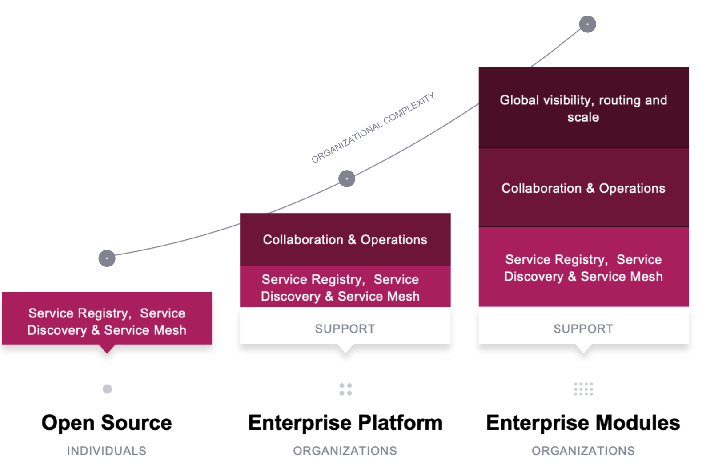

name: Chapter-1
class: title
# Chapter 1
## Enterprise Overview

---
name: Enterprise-Overview
class: img-center compact
Consul OSS to Consul Enterprise
-------------------------
.center[]

Consul Enterprise adds operations, governance, and scalability features for teams and organizations

---
name: Consul-Enterprise-packaging-overview0
class: img-center compact
Consul Enterprise packaging overview
-------------------------
**Consul Enterprise - Platform**

.contents[
* **Automated Backups**
 Enable a highly reliable backup process for disaster recovery by automatically saving and restoring the state of Consul servers
* **Automated Upgrades**
 Support zero-downtime upgrade and avoid version incompatibility through gracefully promoting and demoting Consul servers without needing operator intervention
* **Redundancy Zones**
 Improve resiliency by supporting advanced Consul deployment pattern within an availability zone
]

---
name: Consul-Enterprise-packaging-overview1
class: img-center compact
Consul Enterprise packaging overview
-------------------------
**Consul Enterprise - Global Visibility, Routing & Scale module**

.contents[
* **Enhanced Read Scalability**
 Ensure performance at scale by allowing additional read throughput without impacting write latency
* **Network Segments**
 Support isolated network subnet deployment within a region by creating isolated LAN segments
* **Advanced Federation**
 Support complex network topologies (such as hub-and-spoke) by allowing to specify a relationship between any pair of regions
]

---
name: Consul-Enterprise-packaging-overview2
class: img-center compact
Consul Enterprise packaging overview
-------------------------
**Consul Enterprise - Governance & Policy module**

.contents[
* **Namespaces**
 Run a single shared service of Consul, but create isolated environments in the shared cluster and apply the required service access restrictions for authenticated users, by groups
]
