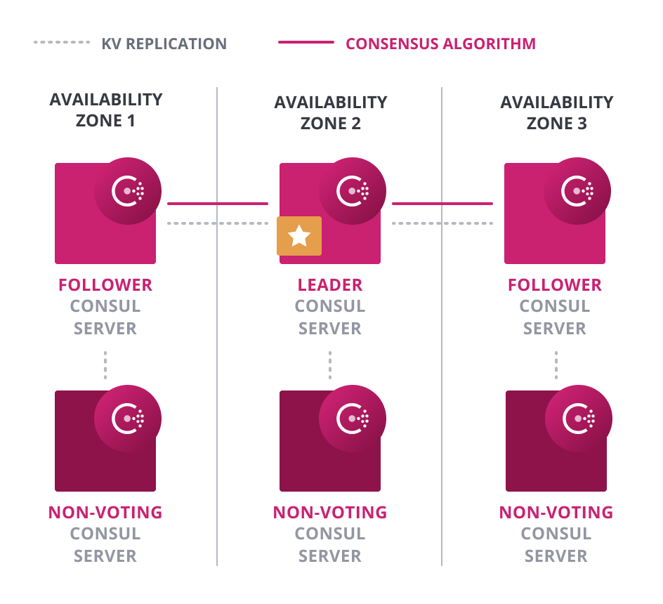
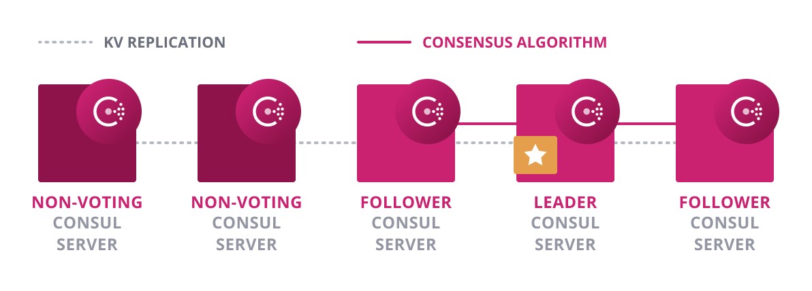
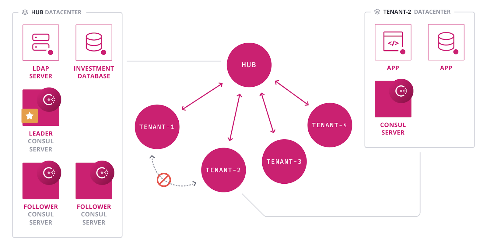

name: Chapter-1
class: title
# Chapter 1
## Enterprise Overview

---
name: Enterprise-Overview
class: img-center compact
Consul OSS to Consul Enterprise
-------------------------
.center[]

Consul Enterprise adds operations, governance, and scalability features for teams and organizations

---
name: Consul-Enterprise-packaging-overview0
class: img-center compact
Consul Enterprise packaging overview
-------------------------
**Consul Enterprise - Platform**

.contents[
* **Automated Backups**
 Enable a highly reliable backup process for disaster recovery by automatically saving and restoring the state of Consul servers
* **Automated Upgrades**
 Support zero-downtime upgrade and avoid version incompatibility through gracefully promoting and demoting Consul servers without needing operator intervention
* **Redundancy Zones**
 Improve resiliency by supporting advanced Consul deployment pattern within an availability zone
]

---
name: Consul-Enterprise-packaging-overview1
class: img-center compact
Consul Enterprise packaging overview
-------------------------
**Consul Enterprise - Global Visibility, Routing & Scale module**

.contents[
* **Enhanced Read Scalability**
 Ensure performance at scale by allowing additional read throughput without impacting write latency
* **Network Segments**
 Support isolated network subnet deployment within a region by creating isolated LAN segments
* **Advanced Federation**
 Support complex network topologies (such as hub-and-spoke) by allowing to specify a relationship between any pair of regions
]

---
name: Consul-Enterprise-packaging-overview2
class: img-center compact
Consul Enterprise packaging overview
-------------------------
**Consul Enterprise - Governance & Policy module**

.contents[
* **Namespaces**
 Run a single shared service of Consul, but create isolated environments in the shared cluster and apply the required service access restrictions for authenticated users, by groups
]

---
name: Consul-Enterprise-packaging-overview3
class: img-center compact
Consul Enterprise packaging overview
-------------------------
The following slides will give some more details around each of the Consul Enterprise feature introduced earlier.

---
name: Feature-Automated-Backups
class: img-center compact
Feature - Automated Backups
-------------------------
Consul Enterprise automatically saves and restores the state of Consul servers for disaster recovery.

.contents[
* The snapshot feature enables point-in-time backups of the K/V store, ACLs, service catalogs, and prepared queries
* Automated backup files rotation
* Backups can be saved offsite in AWS S3, Microsoft Azure or GCP
]

.contents[
* Ease the burden of developing backup scripts or manually scheduling and performing backups.
* Reduce risk by maintaining the up-to-date state for Consul servers for fast failure recovery.
]

---
name: Feature-Automated-Upgrades1
class: img-right compact
Feature - Automated Upgrades
-------------------------
.center[]

Consul Enterprise automates server upgrades to prevent downtime.

.contents[
* New servers with higher version auto-join.
* Autopilot waits until enough upgraded consul servers have joined the cluster. It then starts to demote the old servers and promotes the new versions until the transition is complete.
]

---
name: Feature-Automated-Upgrades2
class: img-right compact
Feature - Automated Upgrades
-------------------------
.center[]

Consul Enterprise automates server upgrades to prevent downtime.

.contents[
* New servers with higher version auto-join as non-voting servers.
]

---
name: Feature-Automated-Upgrades3
class: img-right compact
Feature - Automated Upgrades
-------------------------
.center[]

Autopilot waits until enough upgraded consul servers have joined the cluster. It then starts to demote the old servers and promotes the new versions until the transition is complete.

.contents[
* Eliminate the need for manually promote and demote servers.
* Prevent downtime disruption due to incompatibility or upgrade transition.
]

---
name: Feature-Redundancy-Zones
class: img-right compact
Feature - Redundancy Zones
-------------------------
.center[]

**Non-voting servers**
 Consul Enterprise supports the deployment of one voting and one non-voting Consul server per zone.
 **Autopilot** feature can automatically promote the non-voting server to a voting server in the cluster, when a voting server is lost.

.contents[
* Reduces risk by enabling redundancy deployment in each availability zone, without impacting performance.
]

---
name: Feature-Enhanced-Read-Scalability
class: img-right compact
Feature - Enhanced Read Scalability
-------------------------
.center[]

**Non-voting servers**
Consul Enterprise enables non-voting servers that only handle read requests but do not participate in consensus.
 Non-voting servers receive the K/V replication streams but do not vote in the quorum.

.contents[
* Reduce risk by increasing the scale that a consul cluster can handle for read intensive operations, without impacting write performance.
* Removing performance bottlenecks caused by read-intensive operations.
]

---
name: Feature-Network-Segments1
class: img-right compact
Feature - Network Segments
-------------------------
.center[]

Consul Enterprise enables operators to create separate LAN gossip segments in one Consul cluster.

.contents[
* Consul servers belong to part of all segments
* Consul clients belong to a particular segment
* Consul clients can only join agents in the same segment as them
* All segments share the same KV store
]

---
name: Feature-Network-Segments2
class: img-right compact
Feature - Network Segments
-------------------------
.center[]

.contents[
* Avoid unnecessary operational complexity required by other walk-around solutions (e.g., using multiple clusters with WAN federation)
* Effectively enforce isolations between group of services to comply with business or regulatory policies.
]

---
name: Feature-Advanced-Federation1
class: img-right compact
Feature - Advanced Federation
-------------------------
.center[]

For organizations with multiple data centers, they are often required to support complex network topologies to meet the business or regulatory requirements, such as hub and spoke or tree structures.
  As Consul OSS only supports a full mesh with all Consul servers connected across data centers, it is challenging to deploy and manage advance federation in a multi-data center scenario.

---
name: Feature-Advanced-Federation2
class: img-center compact
Feature - Advanced Federation
-------------------------
Consul Enterprise allows operators to federate Consul data centers together on a pairwise basis, enabling partially-connected network topologies.

.contents[
* "Network areas" are relationships formed pairwise between the servers in two clusters
* Clusters can only communicate to other clusters they have a network area in common with
* Once Network Areas are defined and joined, federation works the same as WAN Gossip
* RPC and gossip uses TLS
  * Soft fail uses RPC feedback to control online/offline status for a remote cluster; circuit breaks when all servers in a cluster are failed
* Service and KV state are local to each datacenter (no replication)
  * Service and KV operations can be made to remote datacenters with a Network Area in common
* Prepared queries support nearest neighbor routing between datacenters via RTT
]

---
name: Feature-Advanced-Federation3
class: img-right compact
Feature - Advanced Federation
-------------------------
.center[]

**Use Case:**
 Central Management Hub Datacenter with Isolated Spoke Datacenters

.contents[
* Ease the burden of managing a great number of servers in a fully connected mesh.
* Enable advanced inter-cluster communication pattern for large scale deployment or complex network topologies.
]

---
name: Feature-Namespaces1
class: img-right compact
Feature - Namespaces
-------------------------
.center[]

**Namespaces** allows the global operators to
.contents[
* Create isolated environments in the shared cluster and apply the required service access restrictions for authenticated users, by groups.
* Delegate per-tenant admins the capability to manage policies for their own services within the defined scope.
* Remove the need for coordination among teams to prevent conflict for service names
]

---
name: Feature-Namespaces2
class: img-right compact
Feature - Namespaces
-------------------------
.center[]

.contents[
* Ease operational burned at the global scale, while providing flexibility to individual teams by delegating administrative privileges for a given namespace
* Reduce risk of distinct services not utilizing either unique names or unique service tags to be identified as different
]
