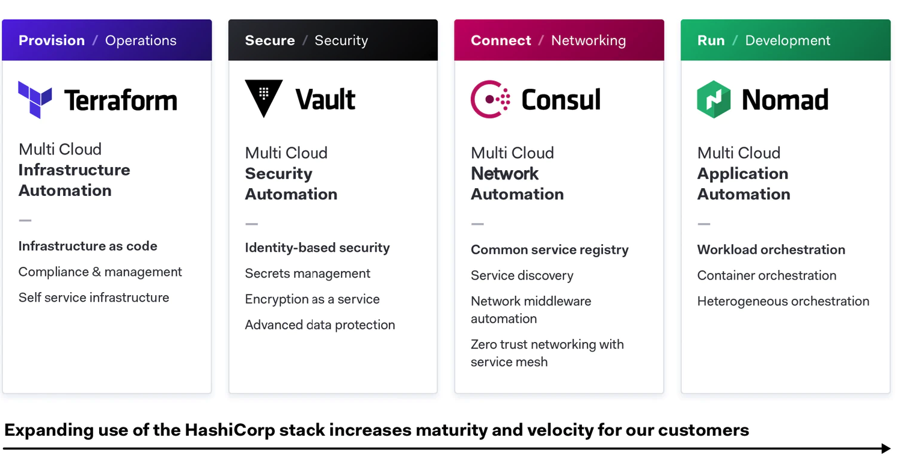
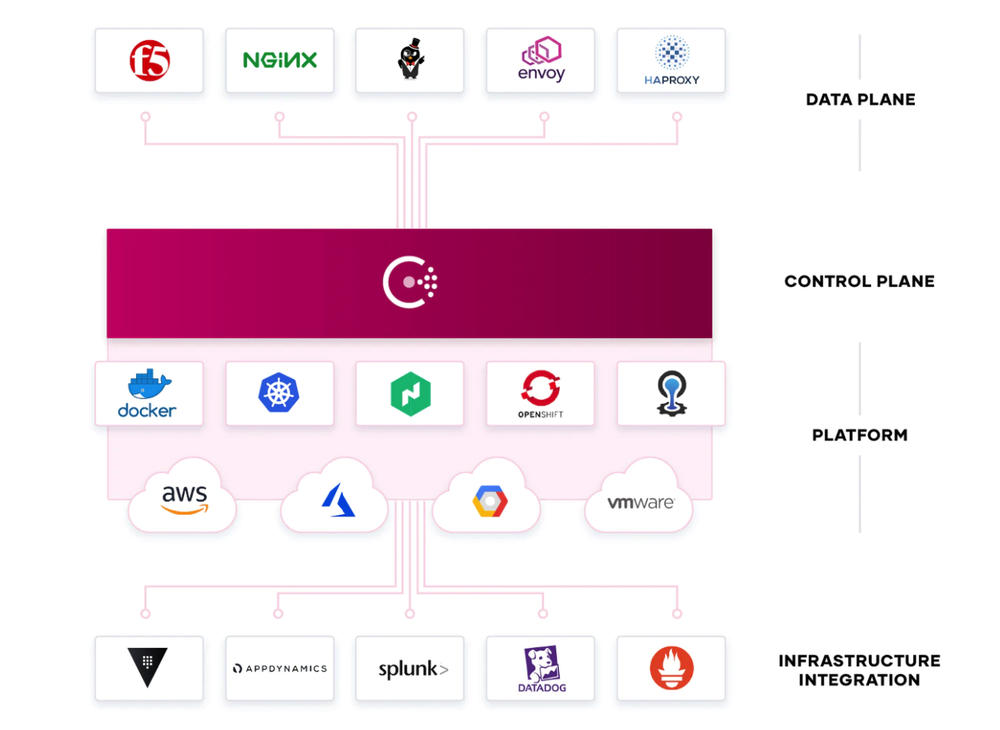
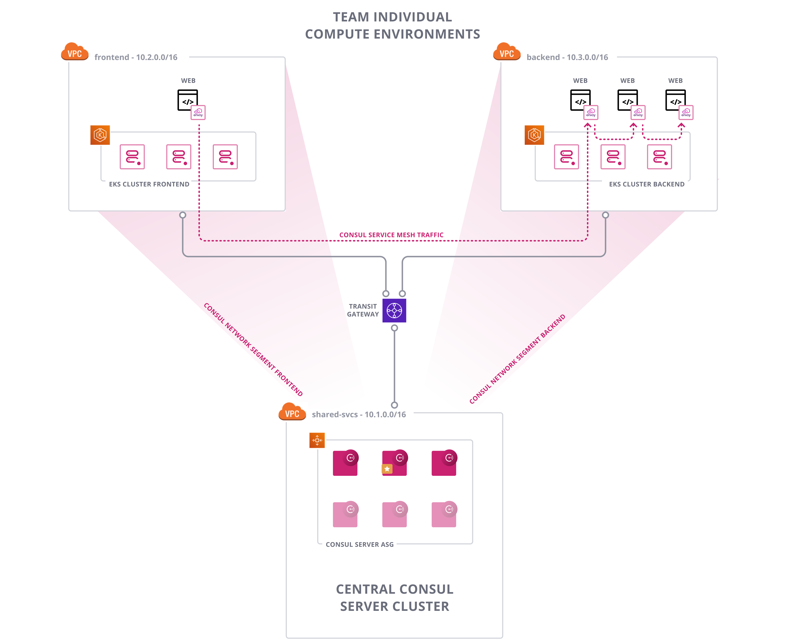
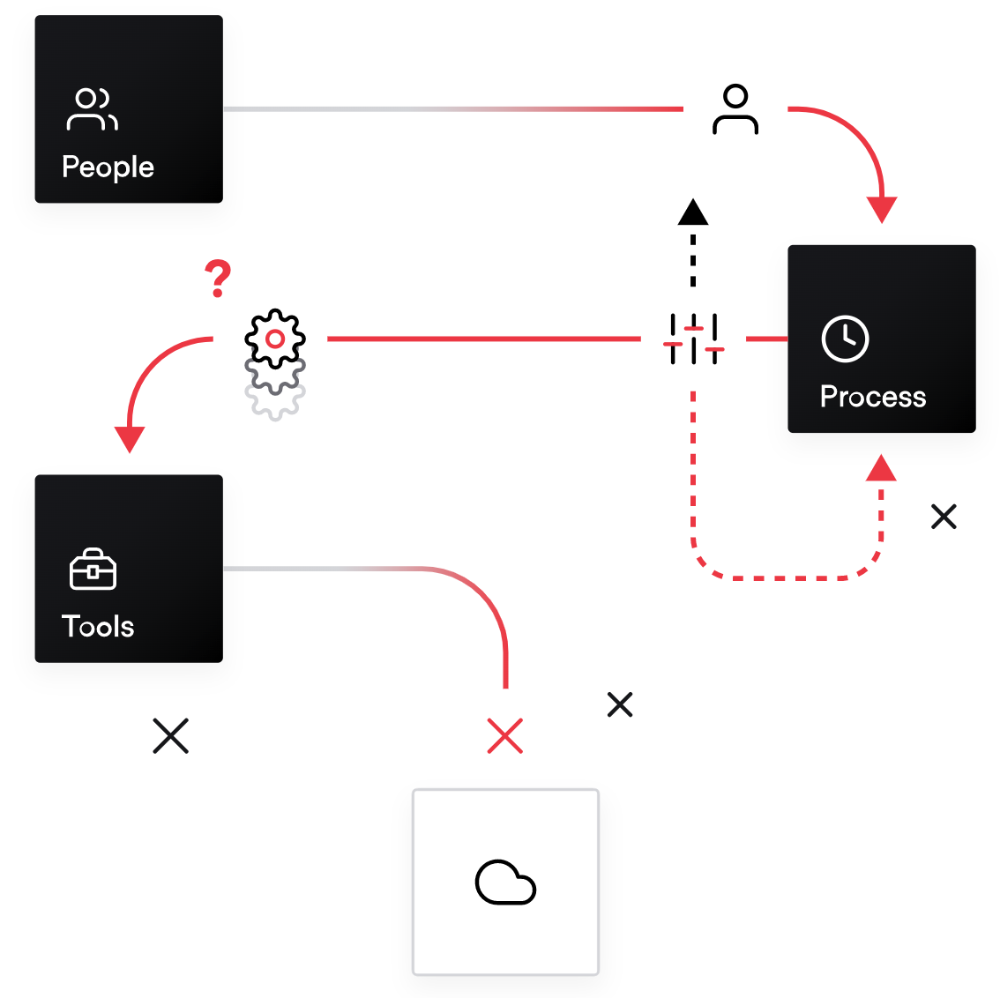

name: Chapter-2
class: title
# Chapter 2
## Consul as a shared Service on AWS

---
name: Consul-On-AWS
class: img-center compact
Consul as a shared Service on AWS
-------------------------

.contents[
* Benefits of running Consul as a shared enterprise wide service
* Different personas interacting and administering a shared Consul service
]

.center[]

---
name: Standardization-is-key
class: img-right compact
Standardization is key
-------------------------
.center[]

**Standardize on a set of shared services**

.contents[
* Standardize on a set of shared services to take full advantage of what the cloud has to offer
* Consul as a central shared service for Multi-Cloud and Multi-Runtime networking
* Challenges around governance and compliance
* Need for setting access control rules
]

---
name: Consul-Shared-Central-Service
class: img-center compact
Consul Shared Central Service
-------------------------
**Example of Consul as a centrally managed shared service**

.center[]

---
name: Personas1
class: img-right compact
Personas
-------------------------
.center[]

**Teams typically involved when running Consul as a shared central service**

.contents[
* Development
* Governance / Compliance
* On-prem Infrastructure
* Cloud Infrastructure
* Networking / Security
* Support / Operations
]

---
name: Personas2
class: img-center compact
Personas - Development
-------------------------
.left[]
**Requirements of Development teams**

.contents[
* "Time to market"
* Easy consumption of service
* No more ticket based networking / firwall requests
* Integration in DevOps workflow
* Team / Project Collaboration
]

**Consul enables**

.contents[
* API based workflows
* Networking Automation
* Service Mesh (Authentication, Authorization, Encryption)
* Central Service Registry
]

---
name: Personas3
class: img-center compact
Personas - Governance / Compliance
-------------------------
.left[]
**Requirements of Governance / Compliance teams**

.contents[
* Visibility
* Controls
* Auditability
* Access Control
]

**Consul enables**

.contents[
* Metrics / Tracing
* Centrally enforced network access patterns
* Audit log
* Fine grained RBAC system
* Shared responsibilities for different tasks
]

---
name: Personas4
class: img-center compact
Personas - Infrastructure
-------------------------
.left[]
**Requirements of Infrastructure teams**

.contents[
* Deployment patterns
* Demarcation points
* Best practice guides
]

**Consul enables**

.contents[
* Easy to deploy single binary solution
* Runtime independence
* Community best practices
* Enterprise Architecture guidance
]

---
name: Personas5
class: img-center compact
Personas - Networking / Security
-------------------------
.left[]
**Requirements of Networking / Security teams**

.contents[
* Network topology complexity
* Network security and visibility
* Multi-Cloud / -Vendor network technologies
* Security Hardening / Least privilege
]

**Consul enables**

.contents[
* Unified networking layer, independend of underlying networking technologies
* Cloud and runtime agnostic networking
* Metrics / Tracing for visibility
* Automated security through Consul intentions
]

---
name: Personas6
class: img-center compact
Personas - Support / Operations
-------------------------
.left[]
**Requirements of Support / Operations teams**

.contents[
* System High Availability
* Education / Knowledge base
* Troubleshooting
* Monitoring
* SLAs / Service offerings
]

**Consul enables**

.contents[
* Availabilty Zone aware High Availability / Resiliency
* Vendor driven classroom trainings and public Forums
* Audit Log / Metrics / Tracing for visibility
* Enterprise Support, Architecture / Implementation Services
]

---
name: Consul-Shared-Central-Service2
class: img-right compact
Consul Shared Central Service
-------------------------
.center[]

.contents[
* Collaboration between different teams
* Central visibility
* Fine grained Access Control depending on needed privileges
* Self service networking with inherited security
* Multi-Cloud and Multi-Runtime Service Mesh
]
