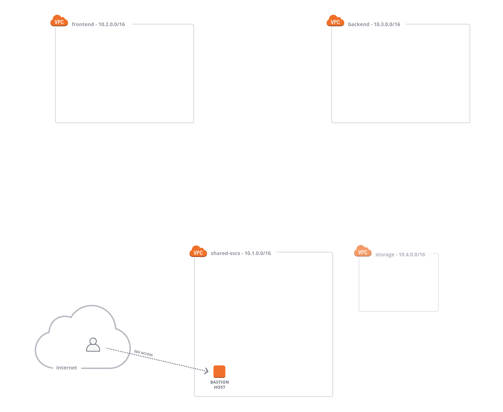

name: Chapter-3
class: title
# Chapter 3
## Consul Enterprise - Platform

---
name: Platform-Overview-Before
class: img-right
Consul Enterprise - Platform (before)
-------------------------
.center[]

Consul Enterprise Platform provides operational features to improve platform reliability.

You will build out your shared service Consul infrastructure with Consul's platform features.

---
name: Platform-Overview-After
class: img-right compact
Consul Enterprise - Platform (after)
-------------------------
.center[]

You will be provision Consul into an AWS ASG in the Shared Service VPC.

Terraform modules are provided by the HashiCorp implementation services.
The module is modified for this lab, and will automatically configure automated backups to S3.

Access to the Consul ASG will be provided through a bastion host.
The Consul API will be exposed over an AWS ALB.

---
name: Consul-Enterprise-Platform-Lab
# 👩‍💻 Lab Exercise: Shared Service Continuity
In this lab you'll perform the following tasks:
  * Provision VPCs
  * Build Immutable Consul Images
  * Provision & Bootstrap Consul ASGs
  * Validate Automatic Migrations
  * Validate Automatic Backups
  * Centralize Consul Secrets in Vault

Your instructor will provide the URL for the lab environment.

🛑 **STOP** after you complete the first quiz.
