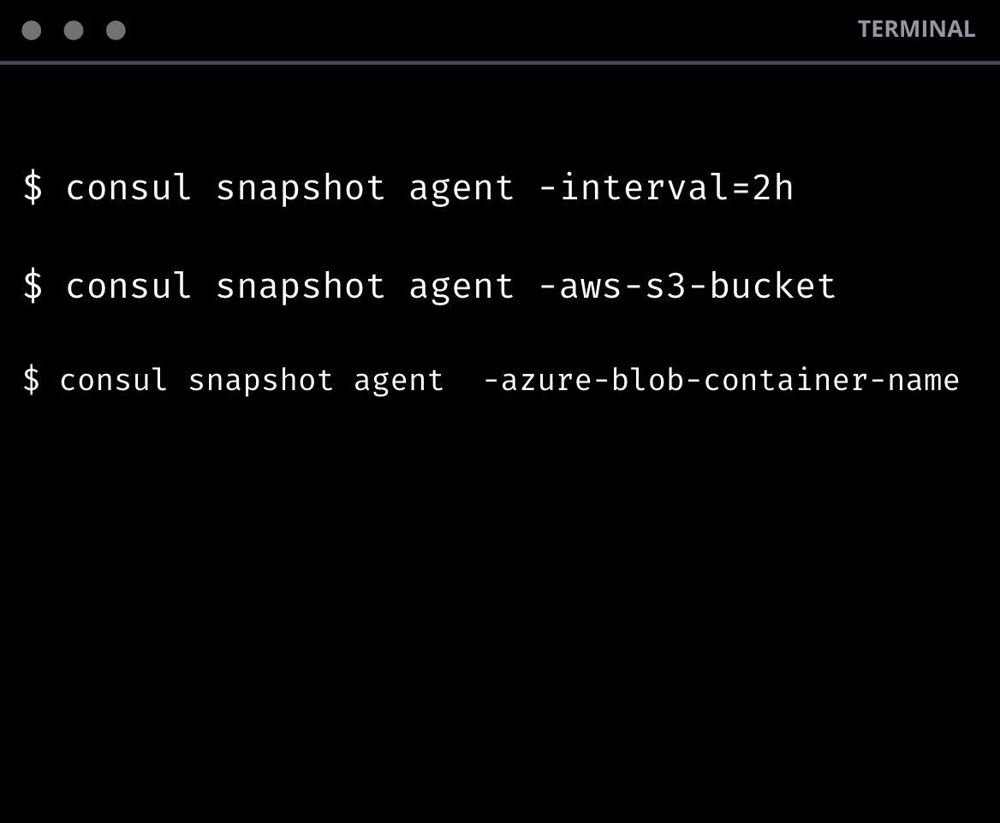
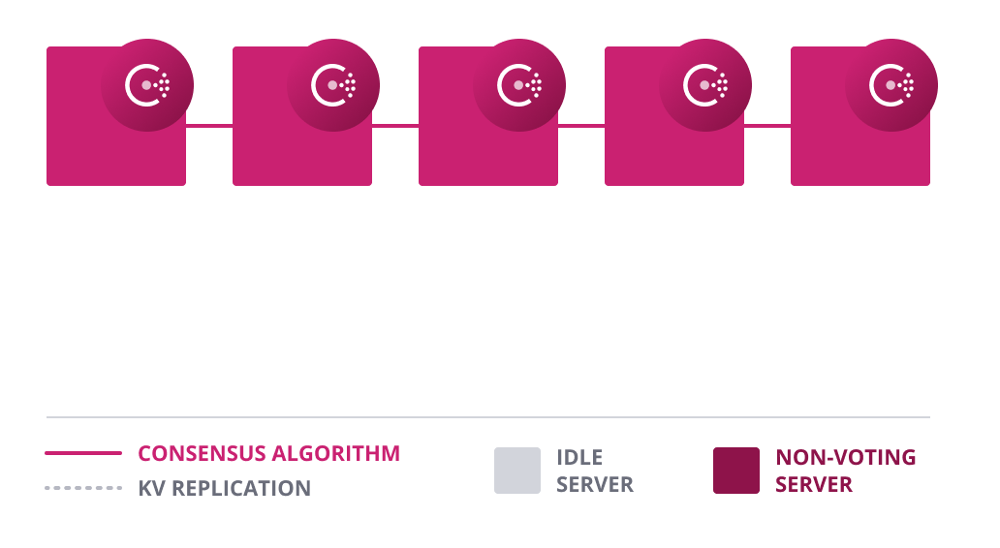
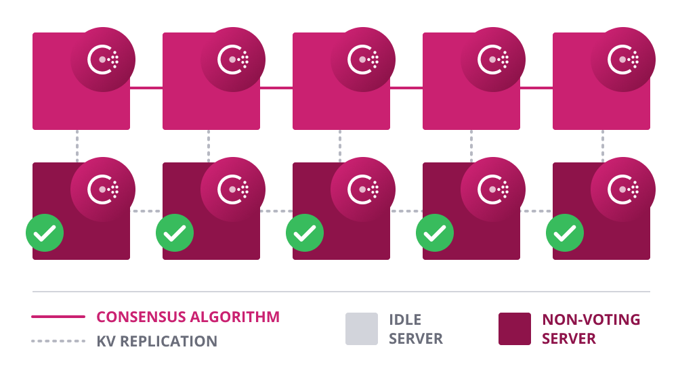
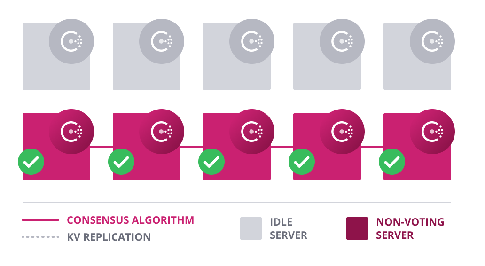

name: Chapter-3
class: title
# Chapter 3
## Consul Enterprise - Platform

---
name: Platform-Overview-Before
class: img-right
Consul Enterprise - Platform (before)
-------------------------
.center[]

Consul Enterprise Platform provides operational features to improve platform reliability.

You will build out your shared service Consul infrastructure with Consul's platform features.

---
name: Platform-Overview-After
class: img-right compact
Consul Enterprise - Platform (after)
-------------------------
.center[]

You will be provision Consul into an AWS ASG in the Shared Service VPC.

Terraform modules are provided by the HashiCorp implementation services.
The module is modified for this lab, and will automatically configure automated backups to S3.

Access to the Consul ASG will be provided through a bastion host.
The Consul API will be exposed over an AWS ALB.

---
name: Platform-Automated-Backups
class: img-right compact
Platform - Automated Backups
-------------------------
.center[]

Consul Enterprise enables you to run the snapshot agent within your environment as a service.  The snapshot agent service operates as a highly available process that integrates with the snapshot API to automatically manage taking snapshots, backup rotation, and sending backup files.

This capability provides an enterprise solution for backup and restoring the state of Consul servers within an environment in an automated manner. These snapshots are atomic and point-in-time, fully managed, and highly available.

---
name: Feature-Automated-Backups
class: img-center compact
Platform - Automated Backups
-------------------------
Consul Enterprise automatically saves and restores the state of Consul servers for disaster recovery.

.contents[
* The snapshot feature enables point-in-time backups of the K/V store, ACLs, service catalogs, and prepared queries
* Automated backup files rotation
* Backups can be saved offsite in AWS S3, Microsoft Azure or GCP
]

.contents[
* Ease the burden of developing backup scripts or manually scheduling and performing backups.
* Reduce risk by maintaining the up-to-date state for Consul servers for fast failure recovery.
]

---
name: Platform-Automated-Upgrades
Platform - Automated Upgrades
-------------------------

Consul Enterprise enables the capability of automatically upgrading a cluster of Consul servers to a new version as updated server nodes join the cluster. This automated upgrade will spawn a process which monitors the amount of voting members currently in a cluster.

Demotion of legacy server nodes will not occur until the voting members on the new version match. Once this demotion occurs, the previous versioned servers can be removed from the cluster safely.

---
name: Feature-Automated-Upgrades1
class: img-right compact
Platform - Automated Upgrades
-------------------------
.center[]

Consul Enterprise automates server upgrades to prevent downtime.

.contents[
* New servers with higher version auto-join.
* Autopilot waits until enough upgraded consul servers have joined the cluster. It then starts to demote the old servers and promotes the new versions until the transition is complete.
]

---
name: Feature-Automated-Upgrades2
class: img-right compact
Platform - Automated Upgrades
-------------------------
.center[]

Consul Enterprise automates server upgrades to prevent downtime.

.contents[
* New servers with higher version auto-join as non-voting servers.
]

---
name: Feature-Automated-Upgrades3
class: img-right compact
Platform - Automated Upgrades
-------------------------
.center[]

Autopilot waits until enough upgraded consul servers have joined the cluster. It then starts to demote the old servers and promotes the new versions until the transition is complete.

.contents[
* Eliminate the need for manually promote and demote servers.
* Prevent downtime disruption due to incompatibility or upgrade transition.
]

---
name: Consul-Enterprise-Platform-Lab
# 👩‍💻 Lab Exercise: Shared Service Continuity
In this lab you'll perform the following tasks:
  * Provision VPCs
  * Build Immutable Consul Images
  * Provision & Bootstrap Consul ASGs
  * Validate Automatic Migrations
  * Validate Automatic Backups
  * Centralize Consul Secrets in Vault

Your instructor will provide the URL for the lab environment.

🛑 **STOP** after you complete the first quiz.
