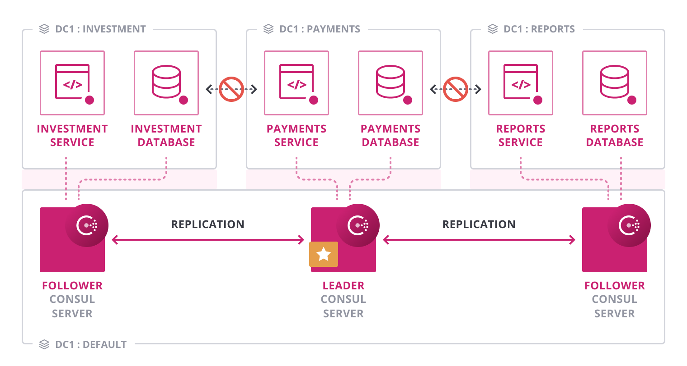

name: Chapter-5
class: title
# Chapter 5
## Consul Enterprise - Global Visibility, Routing and Scale (GVRS)

---
name: Consul-Enterprise-Global-Visibility-Routing-Scale-Overview
class: img-right
Consul Enterprise - Global Visibility, Routing and Scale (before)
-------------------------
.center[]

GVRS provides turnkey features for advanced visibility, routing, and scale.

You will use this module to configure advanced routing between Application and Shared Service VPCs

---
name: Consul-Enterprise-Global-Visibility-Routing-Scale-Overview
class: img-right
Consul Enterprise - Global Visibility, Routing and Scale (after)
-------------------------
.center[]

AWS transit gateway will route traffic across VPCs, and to the Shared Service infrastructure.

Traffic is restricted between Application VPCs.

Consul's Network Segments prevent client agent traffic from gossiping across VPCs for performance and cost savings.

---
name: Feature-Network-Segments1
class: img-right compact
GVRS - Network Segments
-------------------------
.center[]

Consul Enterprise enables operators to create separate LAN gossip segments in one Consul cluster.

.contents[
* Consul servers belong to part of all segments
* Consul clients belong to a particular segment
* Consul clients can only join agents in the same segment as them
* All segments share the same KV store
]

---
name: Feature-Network-Segments2
class: img-right compact
GVRS - Network Segments
-------------------------
.center[]

.contents[
* Avoid unnecessary operational complexity required by other walk-around solutions (e.g., using multiple clusters with WAN federation)
* Effectively enforce isolations between group of services to comply with business or regulatory policies.
]

---
name: Consul-Enterprise-Global-Visibility-Routing-Scale-Lab
# 👩‍💻 Lab Exercise: Advanced Networking Topologies
In this lab you'll perform the following tasks:
  * Create Transitive Peering using AWS Transit Gateway
  * Provision EKS clusters
  * Configure Consul Network Segments for EKS cluster routes

Your instructor will provide the URL for the lab environment.

🛑 **STOP** after you complete the first quiz.
