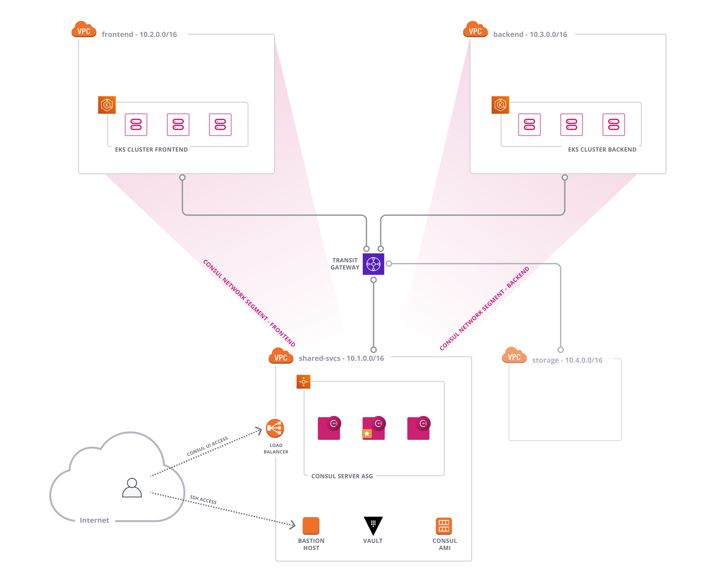
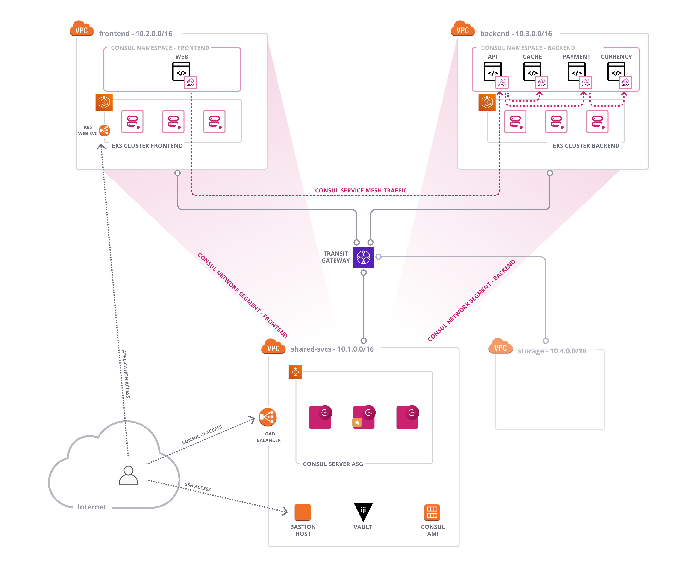
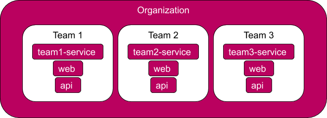

name: Chapter-4
class: title
# Chapter 4
## Consul Enterprise  - Governance and Policy

---
name: Consul-Enterprise-Governance-Policy
class: img-right
Consul Enterprise - Governance and Policy (before)
-------------------------
.center[]

Consul Enterprise Governance and Policy supports multi-tenancy and Policy as Code.

You will use this module to enable self-service networking workflows.

---
name: Consul-Enterprise-Governance-Policy
class: img-right
Consul Enterprise - Governance and Policy (after)
-------------------------
.center[]

The application will be deployed across the frontend and backend application EKS clusters.

Consul Namespaces will allow for developers to own connectivity between services they deploy, and selectively allow other teams to connect into their namespace.

---
name: Feature-Namespaces1
class: img-right compact
Governance and Policy - Namespaces
-------------------------
.center[]

**Namespaces** allows the global operators to
.contents[
* Create isolated environments in the shared cluster and apply the required service access restrictions for authenticated users, by groups.
* Delegate per-tenant admins the capability to manage policies for their own services within the defined scope.
* Remove the need for coordination among teams to prevent conflict for service names
]

---
name: Feature-Namespaces2
class: img-right compact
Governance and Policy - Namespaces
-------------------------
.center[]

.contents[
* Ease operational burned at the global scale, while providing flexibility to individual teams by delegating administrative privileges for a given namespace
* Reduce risk of distinct services not utilizing either unique names or unique service tags to be identified as different
]

---
name: Consul-Enterprise-Governance-Policy-Lab
# 👩‍💻 Lab Exercise: Self-Service Workflows
In this lab you'll perform the following tasks:
  * Create Consul Namespaces and Policies
  * Create Consul Roles in Vault
  * Configure Secrets for EKS clusters
  * Deploy Consul on EKS
  * Deploy applications
  * Configure Intentions

Your instructor will provide the URL for the lab environment.

🛑 **STOP** after you complete the first quiz.
