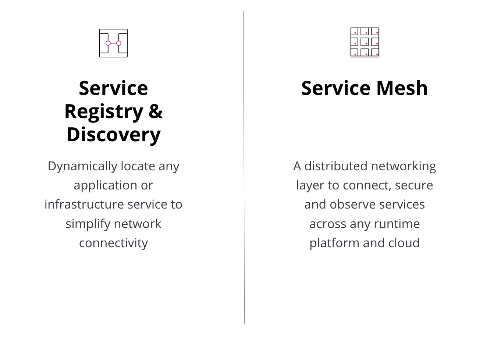
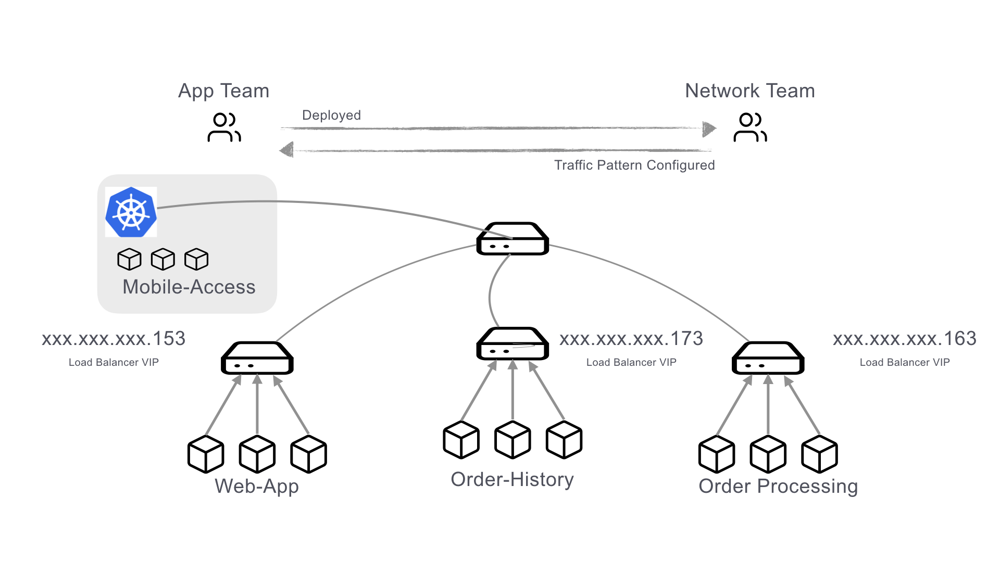
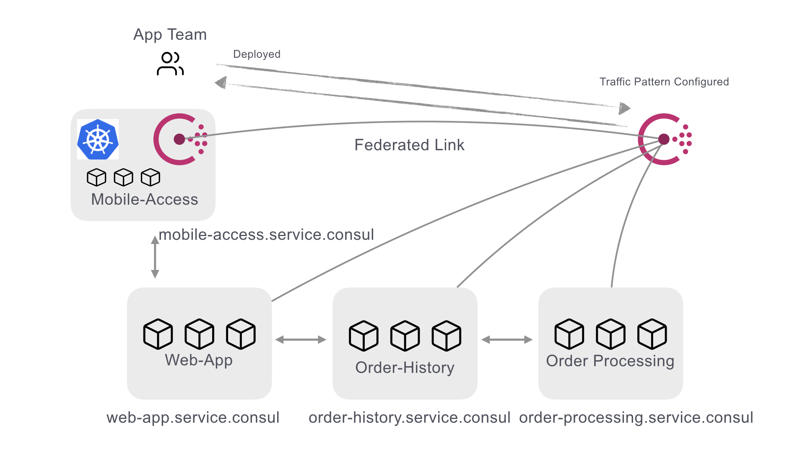
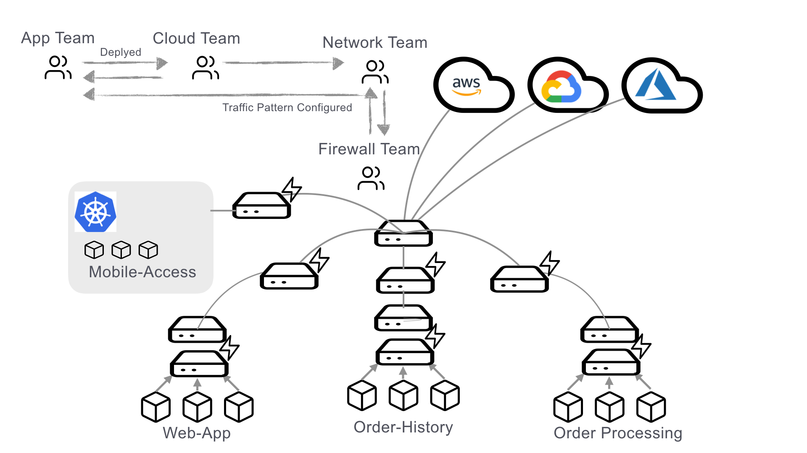
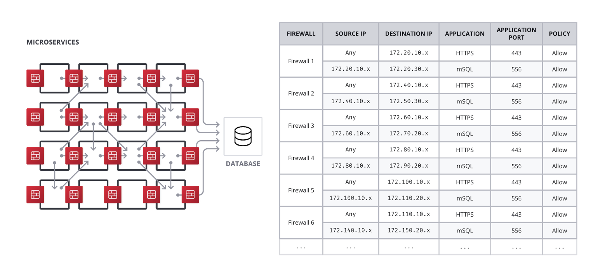
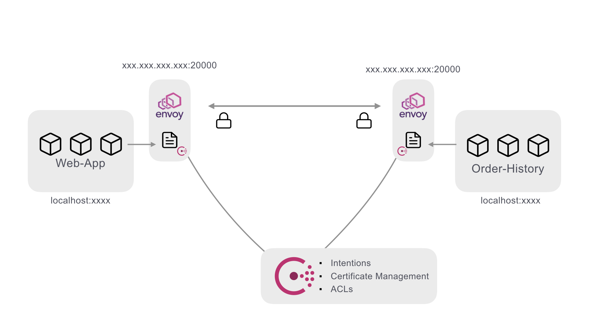
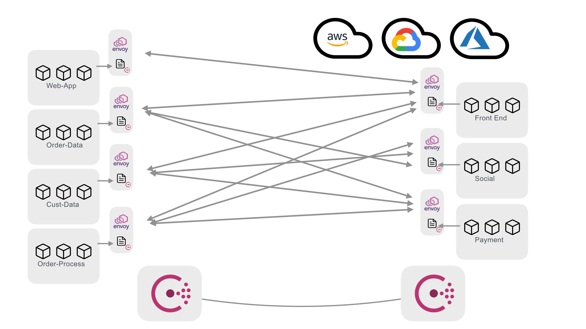
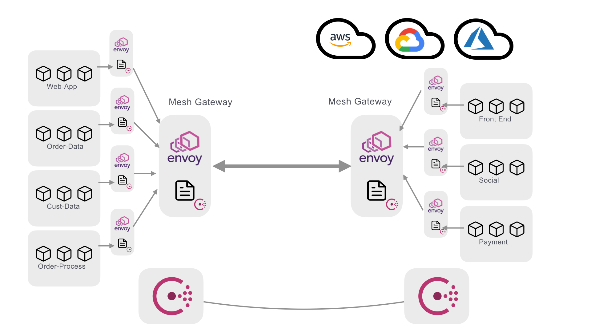

name: Chapter-2
class: title
# Chapter 2
## Consul Use Cases

---
name: Consul-Use-Cases
Consul 적용의 단계
-------------------------
.center[]

???
As we start to dive into how to use Consul it is important to think about how you would go about adopting this in your environments.  First and foremost adopting a standard way of service discovery across a single application or federation of applications is a critical first step.  Because of this we will begin with looking at consul's robust feature set around service discovery. Next we'll look at advanced service networking techniques by exploring how to implement a Service Mesh.

---
name: Load-Balancers-Service-Discovery
class: compact
Service Discovery and Load Balancers
-------------------------

.center[]

* 서비스가 어디에 존재하는지 아는것이 중요함
* 전통적인 Load Balancer로 접근하면
   * 비쌈
   * 점점 유지보수가 어려워짐
   * 확장에 따라 부하가 증가함
   * 모든 백엔드 시스템의 상태를 확인할 수 있는 프로브가 필요함
???
The current mode of operation for handling service discovery is usually done with load balancers as seen here in the diagram.  When I want to provision a new service it gets deployed and then the network team is notified that they need to configure the virtual IPs on the load balancer to pick up the service and start routing traffic to it.  This is time consuming, error prone, and can typically have long lead times.  Consul can help mitigate some of these problems.

---
name: Service-Discovery-with-Consul
class: compact
Service Discovery with Consul
-------------------------
.center[]
* 각 서비스는 자체적으로 등록됨(self-register)
* 서비스 상태는 해당하는 서비스에 의해 정의되고 Consul Agent가 관리
* 서비스는 DNS나 HTTP를 통해 서로 쿼리

???
In a consul environment services are able to register themselves by defining health checks, service names and optional metadata. Coupled with the gossip protocol--which provides node-level health data--service availability and routing data is updated in near real time.  This allows service discovery to be offloaded from the network and load balancer teams and shifted to the application teams.  This is a crucial first step for an organization to take advantage of the benefits of a service mesh, or if they want to simplify basic application routing decisions.


---
name: Myriad-Use-Cases
class: compact
Solve Network Problems with Service Discovery
-------------------------
Consul을 사용하면 DNS 기반 서비스 카탈로그에 논리적인 서비스 쿼리를 구축 할 수 있습니다. 이렇게하면 기본 데이터 센터를 사용할 수 없을 때 투명한 장애 조치가 가능합니다.

```json
{
  "Name": "banking-app",
  "Service": {
    "Service": "banking-app",
    "Tags": ["v1.2.3"],
    "Failover": {
      "Datacenters": ["dc2", "dc3"]
    }
  }
}
```

???
With consul at the heart of service routing based on service names, failover can be defined at the service level with simple extensions to the Consul service definition. This allows for code based resiliency for downstream dependencies.

---
name: Myriad-Use-Cases-Example
Example
-------------------------

Consul 서비스 디스커버리 기능으로 해결할 수있는 다른 많은 실제 사용 사례가 있습니다. 이러한 시나리오 중 일부에는 정상 노드로의 트래픽 자동 라우팅, 블루/그린 배포, 서비스 잠금, 구성 관리 등이 포함됩니다. 이 HashiConf 강연에서 Consul의 실제 사용에 대해 자세히 알아보세요.:

.center[
<a href="https://www.youtube.com/watch?v=XZZDVUCCilM" target=_blank>Consul Infrastructure Recipes - the story of Taco Hub 🌮</a>
]


???
When you have some time, this is a great talk from HashiConf which dives into a number different Consul use cases and give you some bit-size recipes.

---
name: Secure-Networking-is-Hard
class: compact
안전한 네트워킹은 어렵습니다.
-------------------------
.center[]

* 애플리케이션이 서로를 찾을 수있게되면 보안이 다음 관심사가됩니다.
  * 일반적으로 많은 양의 방화벽으로 수행됩니다.
  * 이것은 네트워크 조직에 상당한 부담을 추가합니다.
  * 방대한 방화벽 규칙 목록이 요구됩니다.

???
Okay, so the bottom line is secure networking in moderng application operations is hard. We need devices and services to be able to communicate with one another, and even discover one another, but it can't just be a free-for-all. Our network needs rules to govern who can talk to who, and what information can be passed over it. We traditionally did this with firewalls, but that adds a huge burden by creating single points of failure and potentially massive lists of firewall rules, often updated by humans in human time.

---
name: Firewalls-Wont-Scale
기존의 방화벽 모델은 확장성이 떨어집니다.
-------------------------
.center[]
* 단단한 상호 의존성
* 자동화하기 어려움
* 최적화하기 어려움

???
If you take this mindset to its logical conclusion you will end up with something like this.  Firewalls attached to every service trying to enforce all upstream and downstream communications channels.  At scale and with the speed and dynamics of modern application delivery, this is completely unmanageable.
---
name: Consul-Service-Mesh
Consul Connect - A Modern Service Mesh
-------------------------
.center[]

???
Using consul combined with a proxy (typically Envoy) allows for several improvements.
First, Consul can distribute SPIFFE extended TLS certificates that provide both unique service identities as well as end-to-end encryption. Certificates are automatically rotated, further reducing administrative burden.
Second with Intentions, you can define which services are allowed to talk to each other with simple service names. Connections are enforced by the identities provided by the certificates.
Third Consul adds an additional layer of enforcement by using ACL tokens to make services prove their initial identities to receive their certificates.
The power of this is that all of this can be defined in a simple service definition.

---
name: Consul-Service-Definition
class: compact
Consul Service Definition
-------------------------

```hcl
services {
  name = “web-app"
  port = 9090
  connect {
    sidecar_service {
      port = 20000
      proxy {
        local_service_address = "127.0.0.1"
        local_service_port = 9090
        upstreams {
          destination_name = “order-processing”
          local_bind_port = 8003
        }
      }
    }
  }
}
```

???
As you can see in this example, the connection definition is defined as a part of the service definition.  

---
name: How-do-we-secure-this
어떻게 이 상태에서 보안을 강화할 수 있을까요?
-------------------------
.center[]
.center[큰 힘에는 큰 책임이 따른다.🕸️]

???
Now at scale inside a service mesh there might start to be some issue with all these connections zipping around between datacenters and clouds.  It becomes a lot more difficult to maintain good network edge security when you have a wide berth of communication happening even if the port range is well defined.  

---
name: Mesh-Gateways
Consul Mesh Gateways
-------------------------
.center[]
.center[서로 다른 환경에서 모든 앱 또는 서비스 간의 보안 연결]

???
This problem is addressed with the addition of mesh gateways.  Mesh gateways allow for a single point (or points) at the edge of networks that all mesh traffic flows through.  This allows the network teams to control the ingress/egress points at the edge of the network while still allowing the app teams the flexibility to run application components on the platform of their choosing.  In the next lab we are going to explore the concepts of a service mesh in instruqt.
