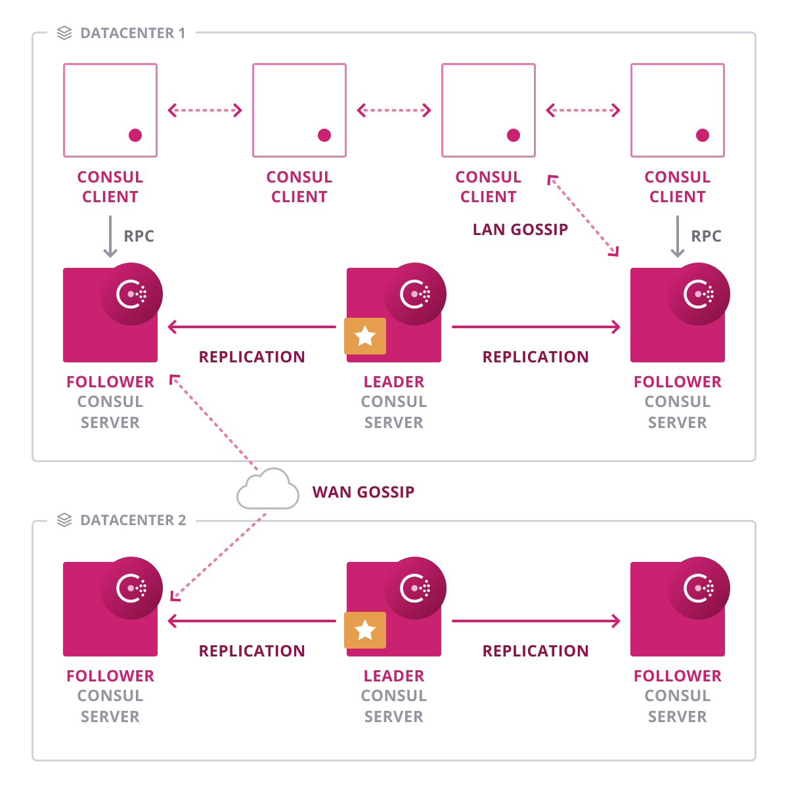

name: Chapter-3
class: title
# Chapter 3
## HashiCorp Consul Architecture

---
name: Introduction-to-Consul
Consul 기본 아키텍처
-------------------------
.center[]

???
Consul is a complex system that has many different moving parts. To help users and developers of Consul form a mental model of how it works, this page documents the system architecture.

In the next sections, we will dive deeper into how  Consul works.

---
name: Introduction-to-Consul-Overview
class: img-right
Consul 기본 아키텍처 - 살펴보기
-------------------------
.center[]

* Consul 클러스터는 "데이터 센터"로 불려짐
* Consul 데이터 센터는 서버 노드와 클라이언트 노드로 구성
* 데이터 센터 당 3 개 또는 5 개의 서버 노드로 구성
* 100 ~ 10,000 개의 클라이언트 노드 커버

???
Within each datacenter, we have a mixture of Consul clients and servers. Typically there are three or five Consul servers. This strikes a balance between availability in the case of failure and performance, as consensus gets progressively slower as more machines are added. However, most operations will not hit the limit in the number of clients, they can easily scale into the thousands or tens of thousands.

---
name: Introduction-to-Consul-Gossip
class: img-right
Consul 기본 아키텍처 - Gossip
-------------------------
.center[]

* 모든 에이전트 통신은 Gossip 프로토콜을 통해 이루어짐
* Consul 에이전트에 대한 자동 구성 및 데이터 센터 검색
* 에이전트 실패는 서버 기준이 아닌 집합된 에이전트 수준에서 수행
* Gossip을 사용하면 기존 하트 비트 방식에 비해 높은 확장 성이 가능
* 노드 실패는 에이전트 실패로 유추

???
Consul uses the gossip protocol for agent-to-agent communication. This provides much greater efficiency with overall Consul communications. Agents can communicate with one another and either obtain information about its peers, or disseminate information to its neighbors.

---
name: Introduction-to-Consul-Consensus
class: img-right
Consul 기본 아키텍처 - Consensus
-------------------------
.center[]

* 모든 Consul 데이터 센터에는 연결된 에이전트를 관리하기 위해 함께 작동하는 서버 노드 그룹이 있음
* Raft를 사용하여 서버 노드가 리더를 선택
* 리더는 모든 쿼리를 처리하고 KV 스토어에 대한 쓰기 권한을 가짐
* 트랜잭션 복제 담당
* 서버 노드에 대한 모든 요청은 리더에게 라우팅

???
The servers in each datacenter are all part of a single Raft peer set. This means that they work together to elect a single leader, a selected server which has extra duties. The leader is responsible for processing all queries and transactions. Transactions must also be replicated to all peers as part of the consensus protocol. Because of this requirement, when a non-leader server receives an RPC request, it forwards it to the cluster leader.

---
name: Introduction-to-Consul-Multi-DC
class: img-right
Consul 기본 아키텍처 - Multi-DC
-------------------------
.center[]

* WAN 연결을 통한 가십도 가능
* 한 데이터 센터의 요청을 다른 데이터 센터로 전달
* 서비스 수준 DR을 허용
* 지리적 서비스 요청 처리가 가능

???
The server agents also operate as part of a WAN gossip pool. This pool is different from the LAN pool as it is optimized for the higher latency of the internet and is expected to contain only other Consul server agents. The purpose of this pool is to allow datacenters to discover each other in a low-touch manner. When a server receives a request for a different datacenter, it forwards it to a random server in the correct datacenter. That server may then forward to the local leader, so cross-datacenter requests are relatively fast and reliable.

---
name: Introduction-to-Consul-Protocols
Consul 기본 아키텍처 - Protocols
-------------------------
Consul의 대표적인 두가지 프로토콜에 대해 이해하는 시간이였습니다.:

* Consensus
* Gossip

???
We've touched briefly on the two main protocols Consul uses. If you'd like to dive a little deeper into both of these, you can find more information at the end of this slide deck.

