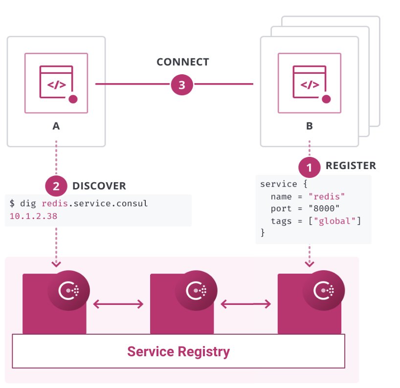
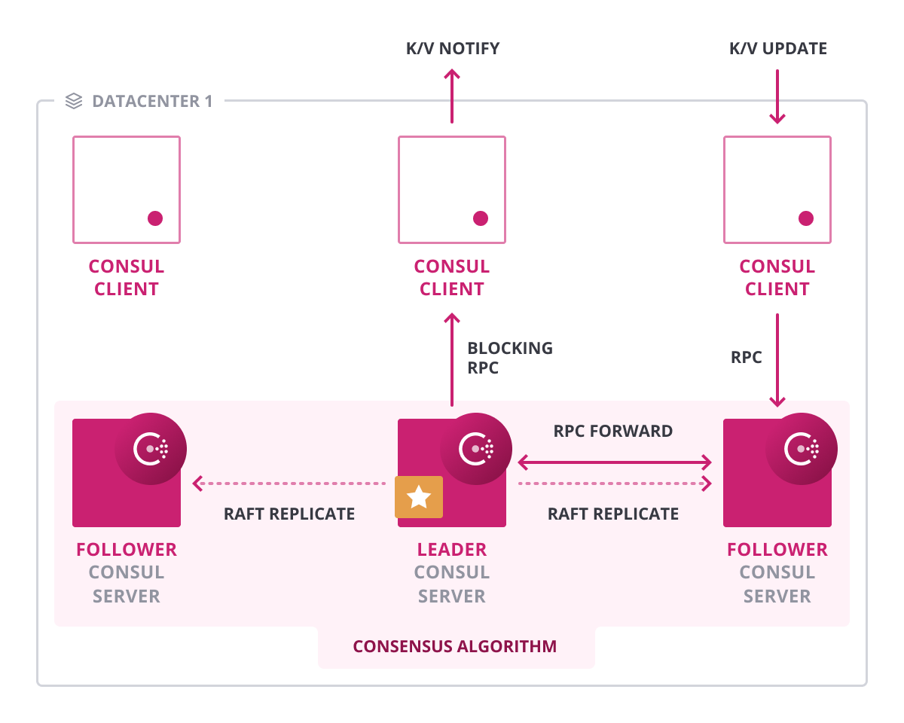
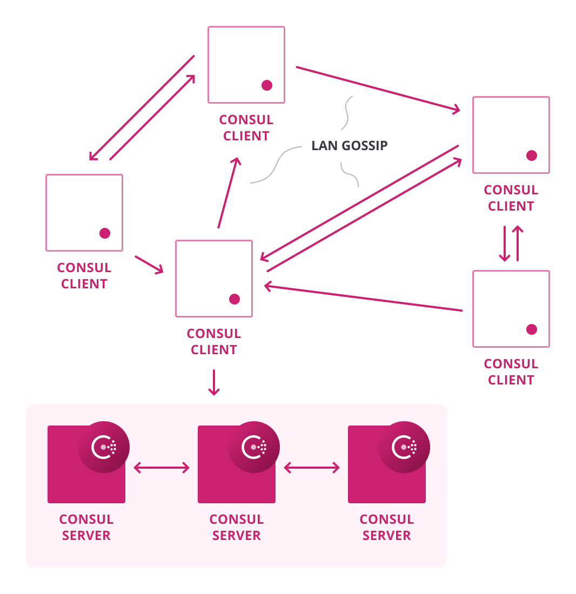
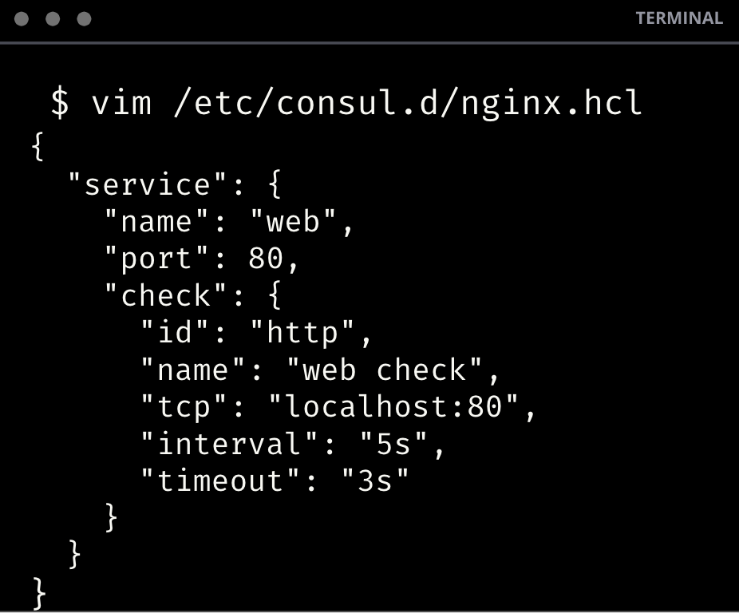
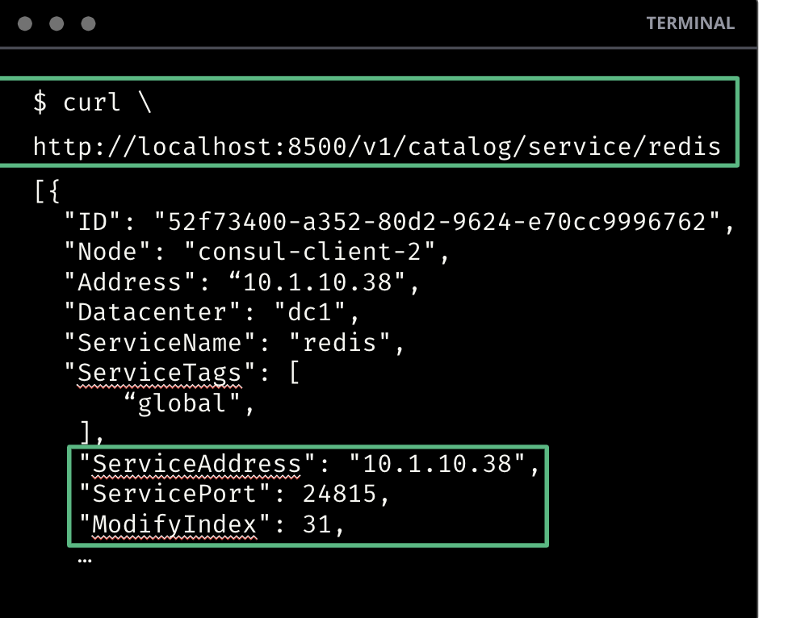
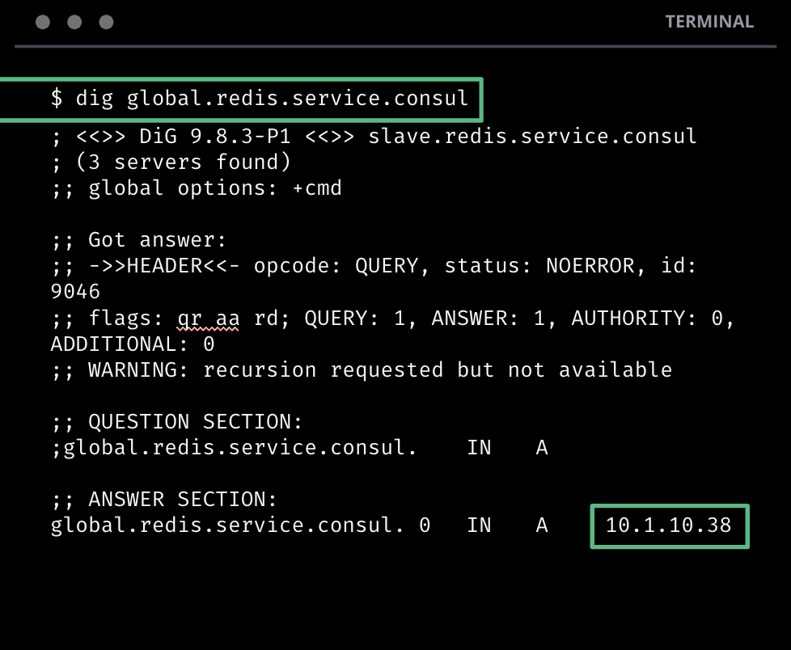
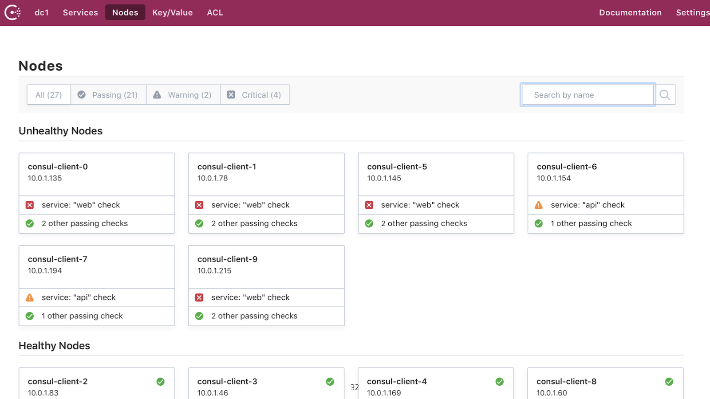
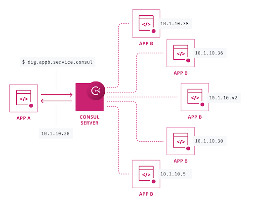
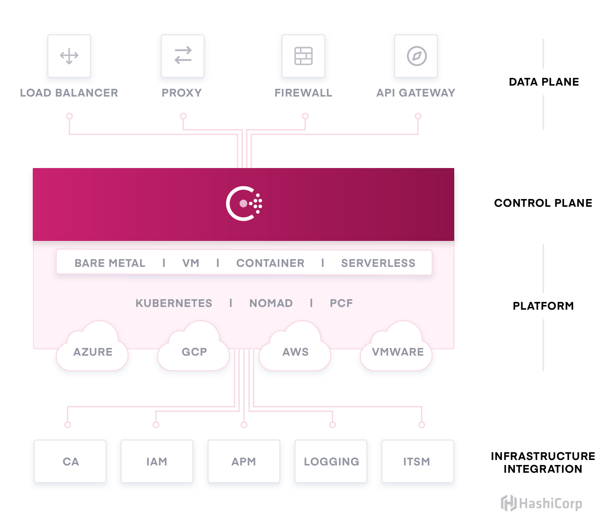
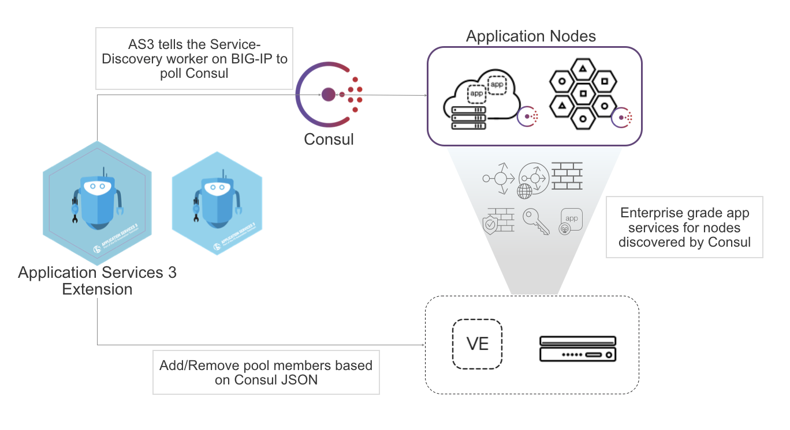

name: Chapter-5
class: title
# Chapter 5
## Service Discovery

---
name: Service-Discovery-Intro
class: img-right compact
Service Discovery - Intro
-------------------------
.center[]

* DNS 및 API 인터페이스
* 상태 체크
* Load Balancer 통합
* Kubernetes
* 다중 클라우드, 다중 DC

???
The starting point for networking with Consul is the service registry. This integrates health checks and provides DNS and API interfaces to enable any service to discover and be discovered by other services.

Consul can be integrated with other services that manage existing north-south traffic such as a traditional load balancers, and distributed application platforms such as Kubernetes, to provide a consistent registry and discovery service across multiple data centers, clouds, and application platforms.

---
name: Service-Discovery-Lab-Servers
class: img-right compact
Service Discovery - Servers
-------------------------
.center[]

* Service catalog
* Replication via Raft

???
Consul's service discovery is backed by a service catalog. The catalog maintains the high-level view of the cluster and is used to expose this information via the various interfaces Consul provides, including DNS and HTTP.

The catalog is maintained only by server nodes because it's replicated via the Raft log to provide a consolidated and consistent view of the cluster.

---
name: Service-Discovery-Lab-Clients
class: img-right compact
Service Discovery - Clients
-------------------------
.center[]

* 클라이언트는 로컬의 서비스를 확인
* Gossip을 통해 노드 상태 확인
* 상태 변경에 대한 정보 만 서버로 전송
* 상태에 대한 서비스 검색 필터
* 확인 유형 - HTTP, TCP, Script 등

???
Each Consul agent maintains its own set of service registrations and health checks to include overall node health. The agents are responsible for executing their own health checks and updating their local state.

---
name: Service-Discovery-Registration
Service Discovery - Config
-------------------------
.center[]
.center[Nginx example]  

???
Configuring a service is pretty straight-forward. Here's an example of a config file to register a simple NGINX service, the health check simple HTTP query on port 80.

---
name: Service-Registry-API
Service Registry - API Interface
-------------------------
.center[]
.center[API Catalog Request]  

???
There are a couple of different ways to discover services. The first is by using the API. The example here uses curl, which is convenient for shell scripts. Applications can do direct HTTP requests using a library that fits the language they are using.

---
name: Service-Registry-DNS
Service Registry - DNS Interface
-------------------------
.center[]
.center[DNS Catalog Request]  

???
The second way is by using DNS. You can query consul using standard hostname resolution either on the command line using tools like dig, nslookup or host, or within applications using native libraries for hostname resolution.

---
name: Service-Registry-UI
Service Registry - UI Interface
-------------------------
.center[]
.center[UI Catalog Request]  

???
Finally, you can login to the Consul UI and lookup the details in the web UI.

---
name: Service-Registry-Integration-Consul-Template
class: img-right compact
Integrations - Consul Template
-------------------------
.center[]

* 코드 변경없이 통합
* 동적 구성
* Load Balancer 구성 관리

???
Rolling out service discovery doesn't need to be complicated. Consul Template is a standalone application that populates values from Consul and dynamically renders updates to any third party configuration files.

A common use case is managing load balancer or proxy configuration files that need to be updated in near-real time. In this way, applications that are not Consul aware can benefit from its dynamic capabilities.

It is also ideal for replacing complicated API queries that often require custom formatting.

---
name: Service-Registry-Integration-DNS
class: img-right compact
Integrations - DNS
-------------------------
.center[]

* Zero-touch
* Round robin load balancing
* 비정상 인스턴스의 자동 필터링

???
Using DNS is a simple way to integrate Consul into an existing infrastructure without any high-touch integration.

---
name: Service-Registry-Integration-Native
class: img-right compact
Integrations - API/Native
-------------------------
.center[]

* SDKs
* Load balancers
* Proxies
* API gateways
* Monitoring tools

???
By leveraging Consul’s RESTful HTTP API system, the community and vendors are able to integrate with Consul's service registry capabilities.

These integrations include SDKs, load balancers, proxies, API gateways, monitoring tools, and more.

If your application is Consul aware, it can connect directly to the API!

---
name: Service-Registry-Integration-Native
class: img-right compact
Example - Native Consul Integration with F5 BIG-IP
-------------------------
.center[]

F5 BIG-IP AS3 서비스 검색 통합은 큰 변경없이 구성 가능하며, Consul의 카탈로그를 쿼리하여 주어진 서비스의 변경 사항에 대한 업데이트를 가져오기 때문에 별도의 운영자 개입없이 동적으로 노드 풀을 조정합니다.

.center[
<a href="https://www.hashicorp.com/resources/zero-touch-application-delivery-with-f5-big-ip-terraform-and-consul" target=_blank>HashiCorp F5 Consul Webinar</a>
]

.center[
<a href="https://github.com/hashicorp/f5-terraform-consul-sd-webinar" target=_blank>Webinar Demo Repo</a>
]

.center[
<a href="https://clouddocs.f5.com/products/extensions/f5-appsvcs-extension/latest/declarations/discovery.html#service-discovery-using-hashicorp-consul" target=_blank>F5 Consul Docs</a>
]

???
We've been working tirelessly with our partners to provide solid and reliable integrations with the tools you may already have. One of those partners is F5. The resources on this page will show you how to dynamically configure your F5 BIG-IP load balancers so you can help your engineering team automate software delivery.

---
name: Service-Discovery-Lab
# 👩‍💻 Lab Exercise: Service Discovery
.blocklist[
이 실습에서는 다음을 수행합니다.:

* 서비스 등록
* Health Checks
* Service Discovery
* Automated Config Management
* Seamless DNS integration
]

(강사가 실습 환경을 위한 URL을 제공합니다.)
