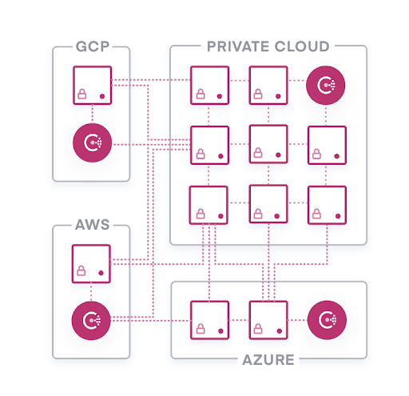
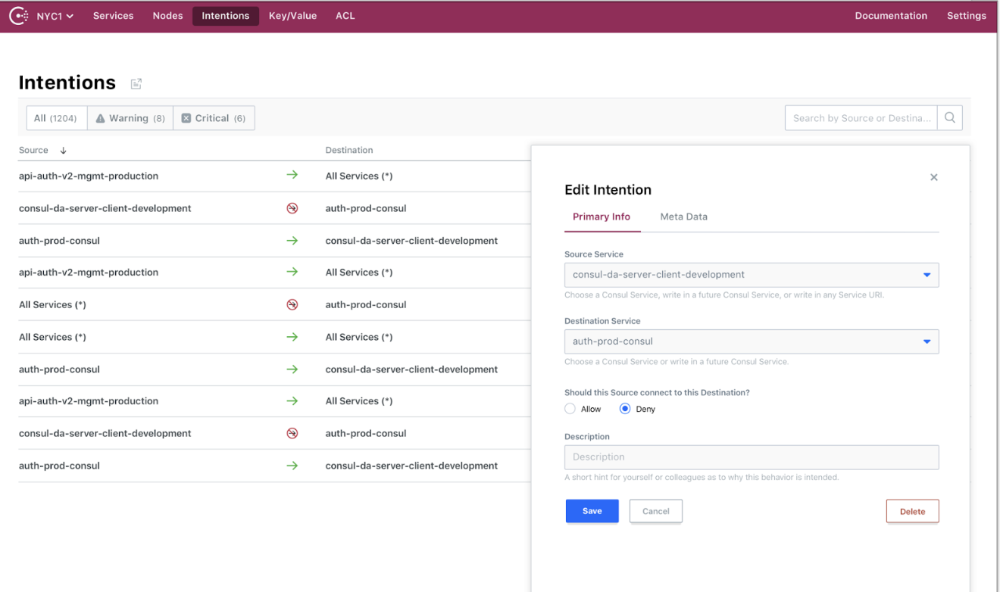
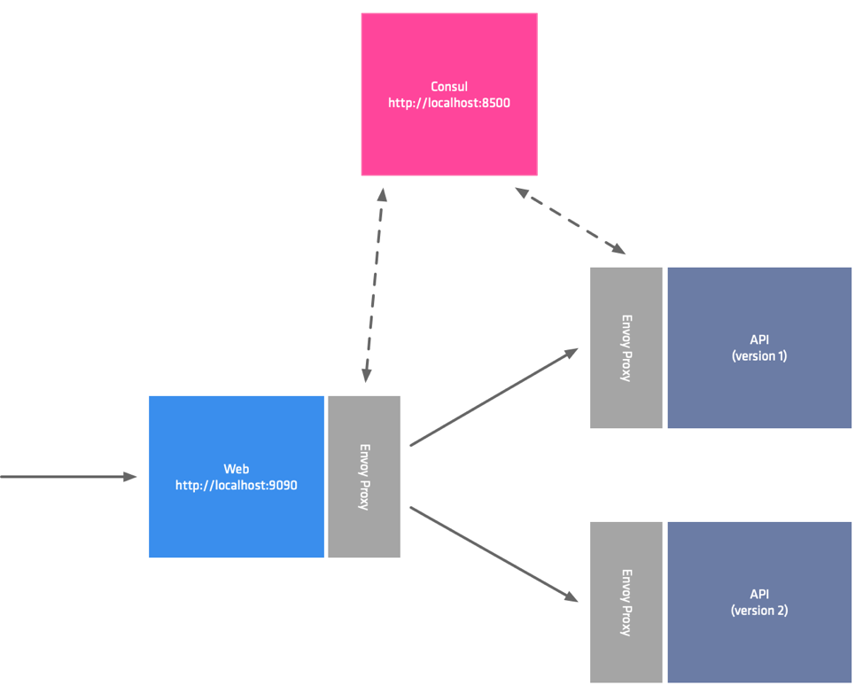
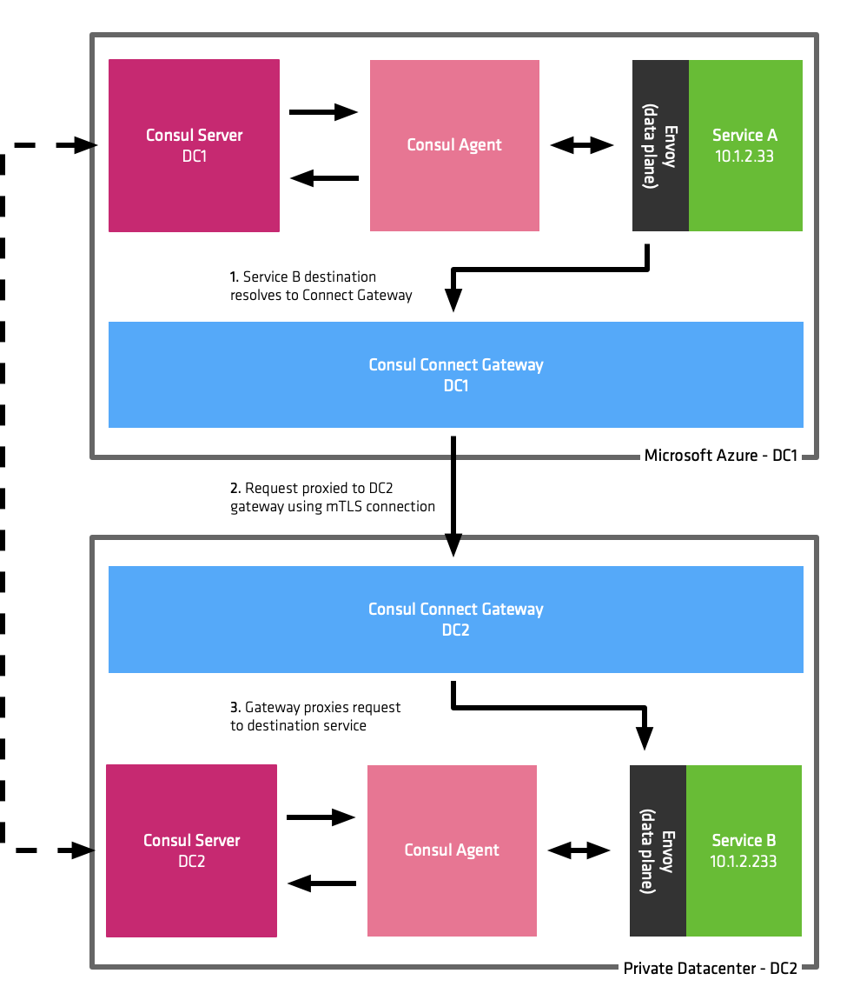

name: Chapter-6
class: title
# Chapter 6
## Service Segmentation

---
name: Segmentation-Intro-Routing
class: img-right compact
Service Segmentation - Intro
-------------------------
.center[]

* Service naming
* 분할(Segmentation)
* 인가(Authorization)
* Routing

???
Consul provides a distributed service mesh to connect, secure, and configure services across any runtime platform and cloud.

It provides a highly scalable API driven control plane, and integrates with an array of common proxies that serve as the data plane. Envoy is the most widely used in most service meshes.

This allows critical functionality like naming, segmentation and authorization, at the edge rather than using centralized middleware.  But Consul is flexible.  I can also be used in hybrid environments that employ traditional networking techniques.

---
name: Segmentation-Intro-Security
class: img-right compact
Service Segmentation - Intro
-------------------------
.center[]

* Automatic mTLS
* PKI certificate management
* API-driven

???
Consul enables fine grained service segmentation to secure service-to-service communication with automatic TLS encryption and identity-based authorization.

Consul is flexible and can also integrate it with common centralized PKI and certificate management systems like HashiCorp Vault.

Service configuration is achieved through an API-driven Key/Value store that can be used to easily configure services at runtime in any environment.

---
name: Segmentation-Control-Plane
class: img-right compact
Service Mesh Architecture - Control Plane
-------------------------
.center[]

* 신뢰할 수 있는 단일 소스
* 노드의 서비스 관리
* 접근 관리

???
The Control Plane is responsible for configuring the data plane. It's responsible for features like network policy enforcement and providing service discovery data to the data plane. It is designed to be highly scalable by not making direct decisions on traffic by sending instructions to the data plane only when something changes.   This leverages capabilities such as long polling and integrated K/V that have been part of Consul since the beginning.

Consul is the control plane for the Connect service mesh:

* Single source of truth for service catalog, routing, and access policies
* Manages registered services and health checks for that node
* Manages certificates and access policies and configures the proxy

---
name: Segmentation-Data-Plane
class: img-right compact
Service Mesh Architecture - Data Plane
-------------------------
.center[]

* 애플리케이션 요청 관리
* 높은 처리량, 낮은 지연시간
* 고급 L7 기능

???
The Data Plane provides the ability to forward requests from the applications, including more sophisticated features like health checking, load balancing, circuit breaking, authentication, and authorization.

The Data Plane is in the critical path of data flow from one application to the other and hence the need for high throughput and low latency.

The Consul Envoy integration is currently the primary way to utilize advanced layer 7 features provided by Consul, but can integrate with other third party proxies.

The Consul data plane caches instructions from the control plane and only changes on updates making it extremely fast and highly scalable. 

---
name: Segmentation-Identity
class: img-right compact
Service Mesh - Identity
-------------------------
.center[]

* 서비스 아이덴티티 제공
* 모든 트래픽의 암호화
* SPIFFE와 호환되는 TLS 인증서
* 내장된 CA, 또는 Vault와 같은 외부 CA 연동

???
Consul provides each service with an identity encoded as a SPIFFE-compatible TLS certificate. This way, all traffic between services is encrypted. You can use either the build-in certificate authority, or you can use Vault's CA.

---
name: Segmentation-Access-Graph
class: img-right compact
Service Mesh - Service Access Graph
-------------------------
.center[]

* 논리적인 서비스 이름(IP > FQDN)
* 인스턴스와 독립적으로 확장
* Raft로 일관성 보장
* 웹 UI, CLI, API로 관리
* 멀티 데이터센터 지원

???
With each service having its own identity, we're able to allow or deny service-to-service communication with Intentions. Intentions follow the same concept as firewall rules, where you grant or deny access based on source and destination. Except we're not specifying IPs or IP ranges. Instead, we're specifying service names and letting Consul deal with the underlying networking.

Now, we can scale out without adding or deleting firewall rules when service endpoints come alive or die. Because Consul provides a way to federate services between clusters and datacenters, we can securely connect services no matter where they reside.

---
name: Segmentation-Access-Graph
class: img-right compact
Service Mesh - Advanced Routing
-------------------------
.center[]

* 카나리 테스트
* A/B 테스트
* Blue/Green 배포

???
Layer 7 traffic management allows operators to divide L7 traffic between different subsets of service instances when using Connect.

There are many ways you may wish to segment services beyond simply returning all healthy instances for load balancing. This includes patterns like Canary Testing, A/B or Blue/Green deployments.  

---
name: Segmentation-Mesh-Gateways
class: img-right compact
Service Mesh - Mesh Gateways
-------------------------
.center[]

* 클러스터 간 라우팅 연결
* 멀티 클러스터 상호 연결을 위한 과제 극복
* 암호화는 그대로 유지

???
Mesh gateways enable routing of Connect traffic between different Consul datacenters:

* Datacenters can reside in different clouds or runtime environments where general interconnectivity between all services in all datacenters isn't feasible.
* Gateways operate by sniffing the SNI header out of the Connect session and then route the connection to the appropriate destination based on the server name requested.
* The data within the Connect session is not decrypted by the Gateway.

---
name: Segmentation-Lab
# 👩‍💻 Lab Exercise: Service Segmentation
.blocklist[
이 실습에서는 다음을 수행합니다.:

* 사이드가 배포
* Envoy Proxy에 대해 배우기
* Proxy에 대한 배포와 설정
* Consul을 활용한 트래픽 연결과 보안
]

https://play.instruqt.com/hashicorp/tracks/service-mesh-with-consul
---
name: Segmentation-Lab-K8s
# 👩‍💻 Bonus Lab: Service Segmentation - K8s
.blocklist[
You will accomplish the following in this lab:

* K8에 Connect 배포
* 마이크로 서비스 연결
* 애플리케이션 확장
* 애플리케이션 성능 관찰
]

https://play.instruqt.com/hashicorp/tracks/service-mesh-with-consul-k8s

---
name: Segmentation-Lab-Hybrid
# 👩‍💻 Bonus Lab: Service Segmentation - Hybrid
.blocklist[
You will accomplish the following in this lab:

* K8 및 VM에 Connect 배포
* WAN을 통해 두 개의 데이터 센터 연결
* 메시 게이트웨이를 사용하여 다중 데이터 센터 네트워크 복잡성 해결
]

https://play.instruqt.com/hashicorp/tracks/service-mesh-with-consul-hybrid
