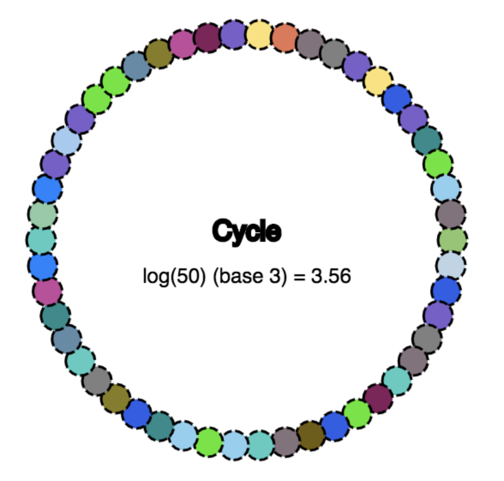
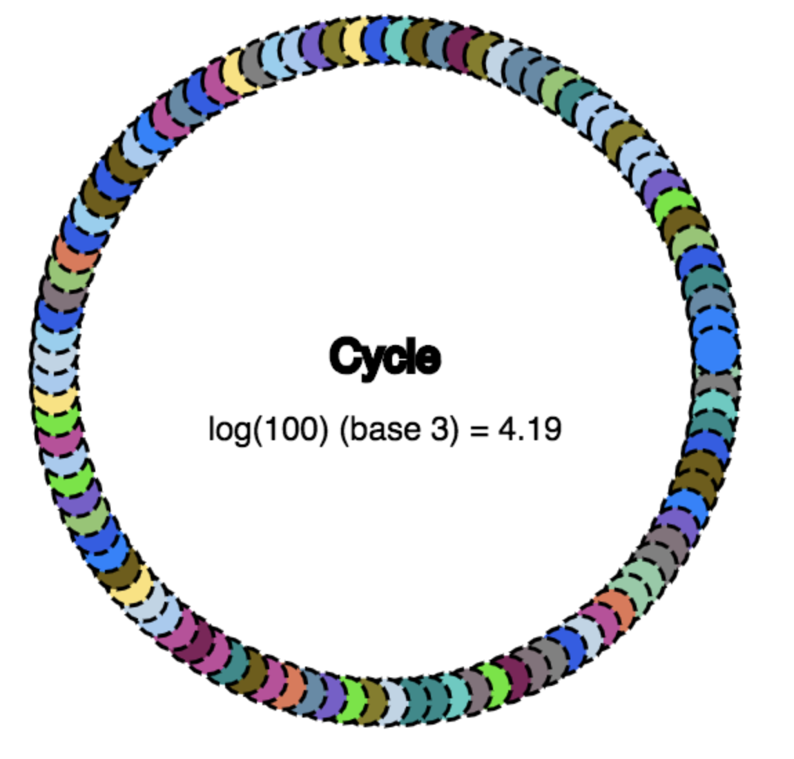
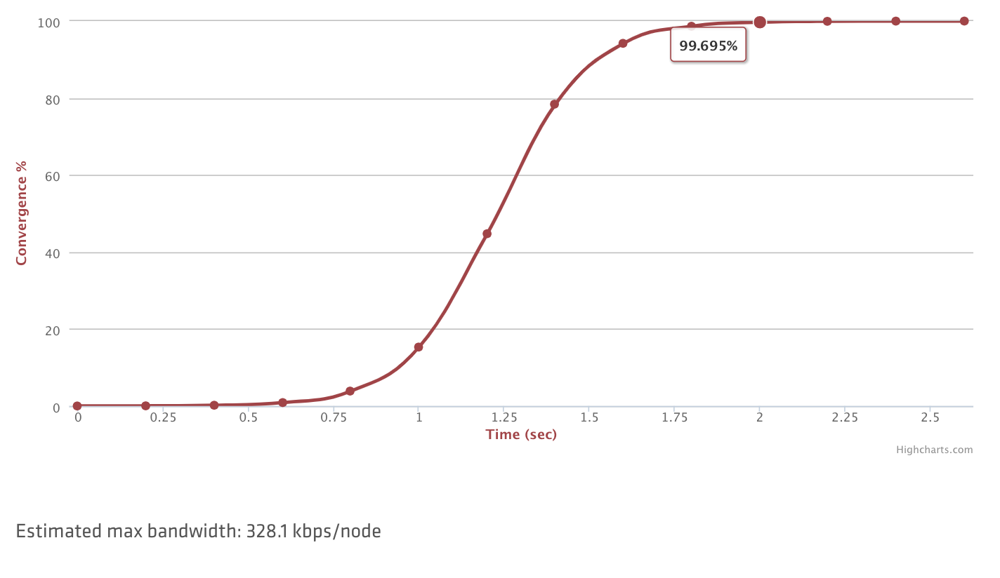

name: Chapter-7
class: title
# Appendix

---
name: Section-Break-Gossip-Consensus
class: title

## Gossip & Consensus

---

name: Introduction-to-Consensus
class: compact
Introduction to Consensus
-------------------------

Consul은 일관성을 제공하기 위해 Consensus 프로토콜을 사용합니다.
Consensus를 자세히 이해할 필요는 없지만 아래는 Consul에 대해 배울 때 유용한 몇 가지 용어입니다.

* **Log** - Raft 시스템의 기본 작업 단위는 `Log` 항목입니다.
* **FSM (Finite State Machine)** - `FSM`은 상태 동기화 사이에 변경이있는 특정 상태 모음을 의미 합니다.
* **Peer set** - `peer set`는 로그 복제에 참여하는 모든 구성원의 세트입니다.
* **Quorum** - `Quorum`은 집합의 과반수에 대한 의미로 사용됩니다.
* **Committed Entry** - 항목이 노드 쿼럼에 지속적으로 저장 될 때 커밋 된 것으로 간주됩니다.
* **Leader** - 언제든지 피어 세트는 단일 노드를 리더로 선택합니다.

다음 슬라이드에서 Raft에 대한 동작을 확인할 수 있습니다.

---
name: Consensus-Visualization
Consensus - A Visualization
-------------------------
    
### .center[
<a href="http://thesecretlivesofdata.com/raft/" target="_blank">Raft Consensus Visualization</a>
]

---
name: Consensus-Modes
class: compact
Consensus - Consistency Modes
-------------------------

내부적으로 Consensus를 이해할 필요는 없지만 워크로드에 맞게 최적화 할 수 있도록 다양한 일관성관련 모드를 이해해야합니다.

* **Default** - Raft는 리더 leas time을 사용하여 리더가 자신의 역할이 안정적이라고 가정하는 시간을 제공합니다. 읽기 작업에 성능이 요구되는, 일반적으로 강력하고 일관성이 있으며 트리거하기 어려운 상황에서만 부실하기 때문에 이러한 절충안을 만듭니다.

* **Consistent** - 아주 강한 일관성을 유지하기 위한 모드입니다. 항상 일관되게 동작하지만 추가 일관성 확인을 위한 작업으로 지연시간이 증가합니다.

* **Stale** - 이 모드를 사용하면 리더 여부에 관계 없이 모든 서버가 읽기를 서비스하게 됩니다. 읽기의 일관성을 잃을 수 있지만 일반적으로 리더 대비 50밀리초 이내입니다. 리더 없이도 읽기를 지원하기 때문에 클러스터에서 계속 응답을 받을 수 있습니다.

---
name: Consensus-Deployment-Table
class: compact
Consensus - Deployment Table
-------------------------

 

<table class="tg" width=60%>
  <tr>
    <th class="tg-feht">Servers</th>
    <th class="tg-feht">Quorum Size</th>
    <th class="tg-feht">Failure Tolerance</th>
  </tr>
  <tr>
    <td class="tg-3z1b">1</td>
    <td class="tg-3z1b">1</td>
    <td class="tg-3z1b">0</td>
  </tr>
  <tr>
    <td class="tg-2i6h">3</td>
    <td class="tg-2i6h">2</td>
    <td class="tg-2i6h">1</td>
  </tr>
  <tr>
    <td class="tg-3z1b">5</td>
    <td class="tg-3z1b">3</td>
    <td class="tg-3z1b">2</td>
  </tr>
</table>

이 표는 다양한 클러스터 크기에 대한 쿼럼 크기 및 내결함성을 보여줍니다. 권장되는 배포는 서버 3 개 또는 5 개입니다. 장애 시나리오에서는 데이터 손실이 불가피하므로 개발을 제외하고 단일 서버 배포는 권장되지 않습니다. 가능한 경우 서버는 대기 시간이 짧은 별도의 영역에 있어야합니다.

???
Then, shalt thou count to three. No more. No less. Three shalt be the number thou shalt count, and the number of the counting shall be three. Four shalt thou not count, nor either count thou two, excepting that thou then proceed to three. Five is right out.

---
name: Introduction-to-Gossip
Introduction to Gossip
-------------------------
Consul은 Gossip 프로토콜을 사용하여 구성원을 관리하고 클러스터에 메시지를 브로드 캐스트합니다. 이 모든 것은 Serf 라이브러리를 사용하여 제공됩니다. Serf에서 사용하는 가십 프로토콜은 "SWIM : 확장 가능한 약하게 일관된 감염 스타일 프로세스 그룹 멤버쉽 프로토콜"을 기반으로하며 약간의 조정이 있습니다.

You can read more about Serf <a href="https://www.serf.io/docs/internals/gossip.html" target="_blank">here</a>.

Consul gossip이 동작하는 두개의 주요 풀:
* LAN
* WAN

---
name: Introduction-to-Gossip-LAN-Pool
Introduction to Gossip - LAN Pool
-------------------------

* LAN 풀은 데이터 센터의 최소 원자 단위입니다.
* LAN 풀의 멤버십은 다음을 용이하게합니다.
   * 자동 서버 검색
   * 분산 실패 감지
   * 안정적이고 빠른 이벤트 방송

???
Each datacenter Consul operates in has a LAN gossip pool containing all members of the datacenter, both clients and servers. The LAN pool is used for a few purposes. Membership information allows clients to automatically discover servers, reducing the amount of configuration needed. The distributed failure detection allows the work of failure detection to be shared by the entire cluster instead of concentrated on a few servers. Lastly, the gossip pool allows for reliable and fast event broadcasts.

---
name: Introduction-to-Gossip-WAN-Pool
Introduction to Gossip - WAN Pool
-------------------------
* WAN 풀은 WAN 링크를 통해 연결된 여러 consul 데이터 센터의 조합을 추구합니다.
* Consul의 서버 노드만 WAN 풀에 참여합니다.
* 정보는 데이터 센터 간 요청을 허용하는 Consul 서버간에 공유됩니다.
* LAN 풀과 마찬가지로 WAN 풀은 전체 데이터 센터의 정상적인 손실을 허용합니다.

???
The WAN pool is globally unique, as all servers should participate in the WAN pool regardless of datacenter. Membership information provided by the WAN pool allows servers to perform cross datacenter requests. The integrated failure detection allows Consul to gracefully handle an entire datacenter losing connectivity, or just a single server in a remote datacenter.

---
name: Introduction-to-Gossip-Visualization-50-Node
class: compact
Introduction to Gossip - Visualization
-------------------------
.center[]
.center[50 nodes, ~3.56 gossip cycles]  

Consul의 Gossip은 대수적으로 확장되므로 모든 노드에 도달하려면 O (logN) 라운드가 필요합니다.
50 노드 클러스터의 경우 모든 노드에 도달하는 데 약 3.56주기를 추정 할 수 있습니다.

---
name: Introduction-to-Gossip-Visualization-100-Node
class: compact
Introduction to Gossip - Visualization
-------------------------
.center[]
.center[100 nodes, ~4.19 gossip cycles]  

100 개 노드 클러스터의 경우 이는 모든 노드에 도달하는 데 약 4.19주기를 의미합니다. 정말 빠르고 안정된 모델입니다.
대규모 클러스터에 대해 살펴 보겠습니다.

---
name: Introduction-to-Gossip-Convergence
Introduction to Gossip - Convergence
-------------------------
.center[]
.center[10,000개 노드, ~2초내로 수렴]  

위의 그래프는 10k 노드 클러스터를 기반으로 다양한 컨버전스 상태에 도달하는 예상 시간을 보여줍니다. 단 2 초 만에 거의 100 %의 노드에 수렴 할 수 있습니다!

???
All the agents that are in a datacenter participate in a gossip protocol. This means there is a gossip pool that contains all the agents for a given datacenter. This serves a few purposes: first, there is no need to configure clients with the addresses of servers; discovery is done automatically. Second, the work of detecting agent failures is not placed on the servers but is distributed. This makes failure detection much more scalable than naive heartbeating schemes. It also provides failure detection for the nodes; if the agent is not reachable, then the node may have experienced a failure.
