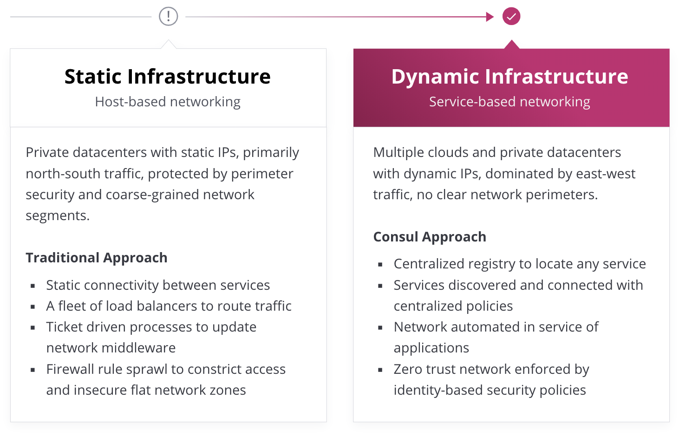
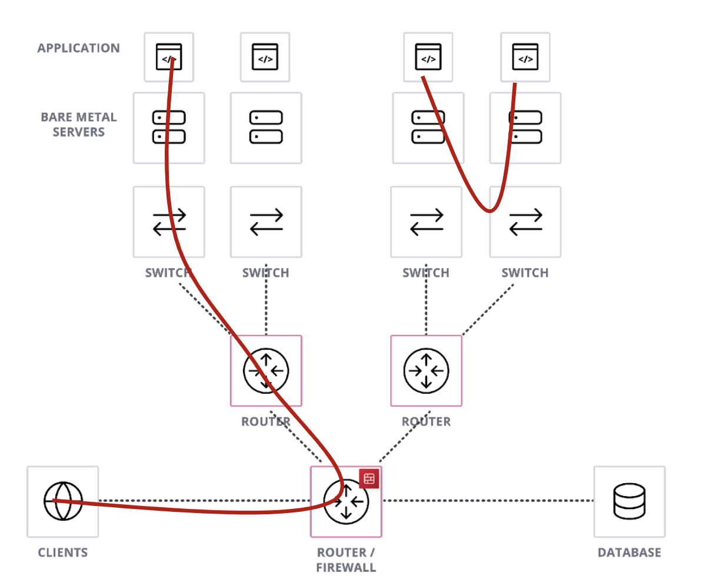
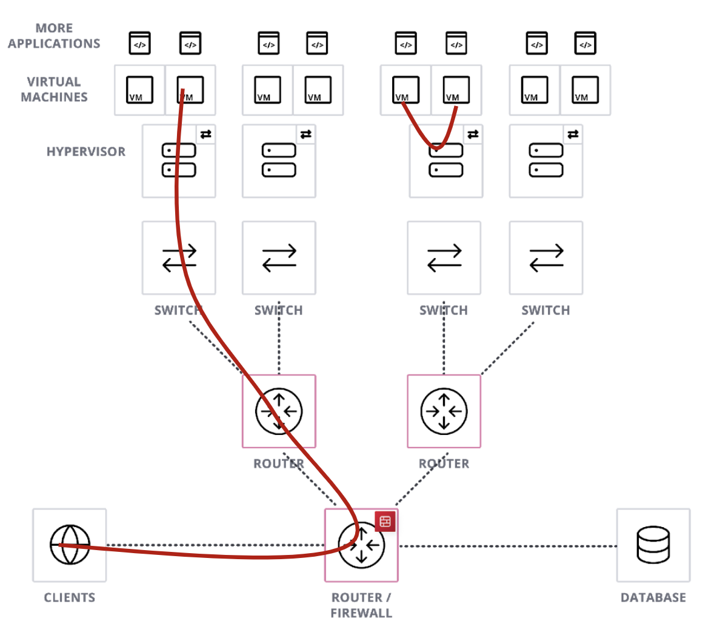
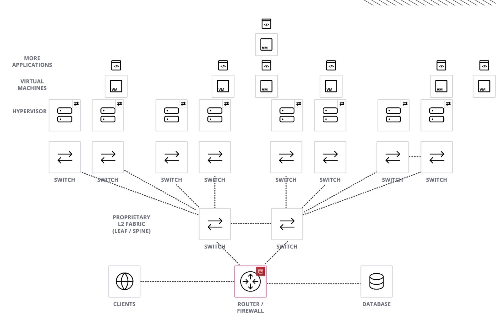
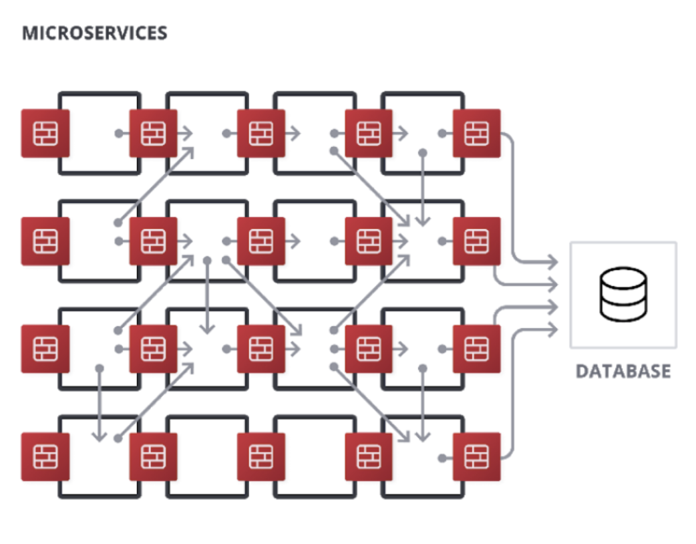
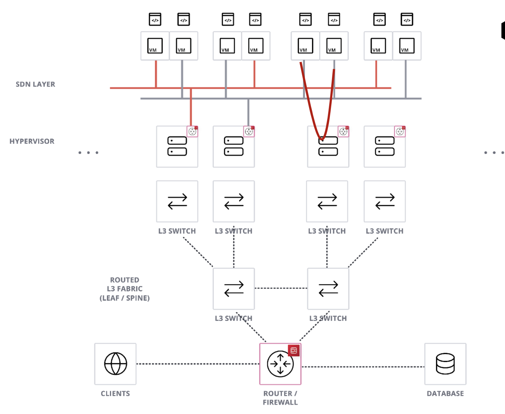
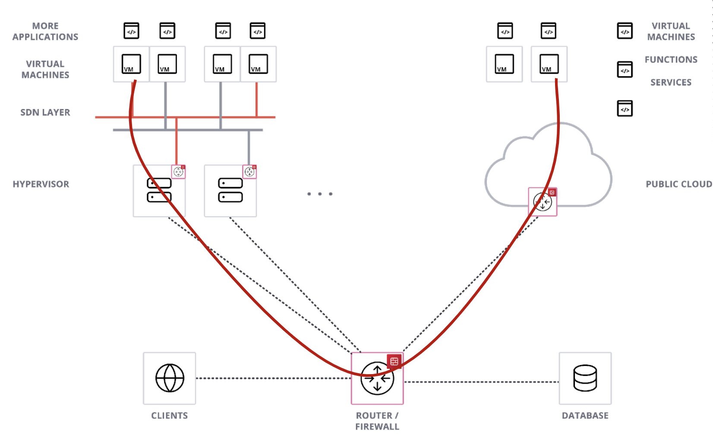
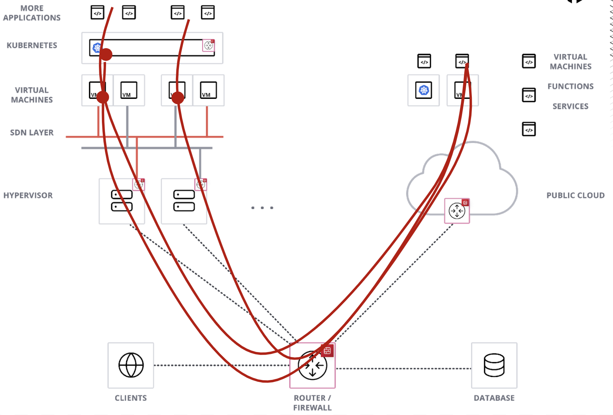
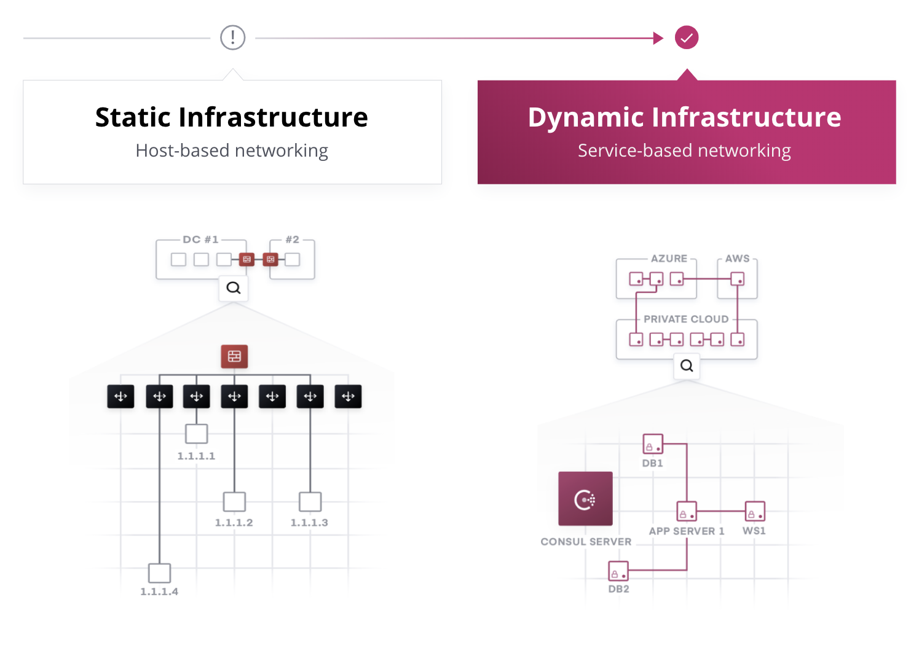

name: Chapter-1
class: title
# Chapter 1
## Introduction to Consul

---
name: HashiCorp-Consul-Overview
Consul Overview
-------------------------
.center[]

HashiCorp Consul is an API-driven service networking solution. It connects and secures all your runtime services across public or private clouds.

For additional descriptions or instructions that expand on this workshop, please see the docs, API guide, and learning site:
* https://www.consul.io/docs/
* https://www.consul.io/api/
* https://learn.hashicorp.com/consul/

???
Consul is a service-based networking tool, which allows you to manage your applications and services in a much more dynamic and fluid way. It has a full API and enables you to automate deployments and secure services across any cloud--public or private.

Hopefully you're following along with this slide deck on your computer so you can follow the links you see on this page. Of course, you can do so at any time.

---
name: The-Shift
The shift from static to dynamic
-------------------------
.center[]
.center[Physical servers, to VMs, to containers...]

As our applications have shifted from monoliths to microservices, the networking landscape has changed drastically. Let's briefly explore the history of this shift, and how Consul can help us solve some of its challenges.

???
Our traditional approach to networking has always had its challenges. But even more so today with the dynamic nature of cloud computing and software delivery. And with the move from monolithic applications to microservices, even more demand is put on the networking infrastructure.

So let's do a quick run through our networking history to see how Consul can address these challenges.

---
name: Client-Server
class: img-right
Introduction of Client & Server
-------------------------
.center[]

  
* Single application per Server
* No app mobility
* Security mapped to IP
* Seldom horizontal scale of an app
* High trust zones and perimeter

???
The Client-Server model was a pretty big shift back in the day, and many didn't think it would survive. The traditional mainframes didn't require near the network demand that the Client/Server model did, and as you can imagine, it was very expensive to upgrade network equipment to support Client/Server. But the pros outweighed the cons, so companies made the investments.

It wasn't long before we started running into new challenges. With the advent of the world wide web and the dot com boom which followed soon after, we found our computing capabilities were severely lacking.

Each application had its own server (typically over-powered to handle peak times), and that application was often setup by hand, meaning it would be very difficult to move the application to another server. IP addresses were hard-coded in order to secure the server and application. Horizontal scaling was expensive and very manual. Inside the private network, it was a free for all with high-trust zones and all applications could typically talk to one another unhindered.

---
name: Introduction-of-VMs
class: img-right
Introduction of the VM
-------------------------
.center[]

  
* Better HW utilization
* Basic networking in Hypervisor
* VM mobility
* Some Horizontal scaling
* Load balancers
* Spanning trees

???
Fortunately, a relic from the distant past was found, dusted off, restored, vastly improved, and delivered as a new, shiny toy: the Virtual Machine. This gave us better resource utilization of our servers. VMs images could be moved from host to host, which meant horizontal scaling was a little easier to achieve. Virtual computing environments also gave way to broader adoption of load balancing tools, which is still an integral part of servicing applications today.

---
name: Introduction-of-the-Fabric
class: img-right
Introduction of the Fabric
-------------------------
.center[]

  
* L2 Fabrics
* Mostly proprietary L2 routing
* More single service instances
* More Load Balancers
* Spine & Leaf

???
As hypervisors started becoming the standard for data centers, we started seeing that support for VM migrations and mobility across subnets was limited. So L2 fabrics were created in order to stretch L2 VLANs across those subnets, and it provided us with a (mostly) full-mesh network. That meant better connectivity for more services and more load balancers. But these were very complex to implement, and if not done well, would yield poor network performance and outages tended to have a larger blast radius.

---
name: Introduction-of-the-Microservice
class: img-right
Introduction of the Microservice
-------------------------
.center[]

  
* Highly maintainable and testable
* Loosely coupled
* Independently deployable
* Organized around business capabilities
* Owned by a small team

???
At the same time networking capacity was growing, development teams' frustration was growing with their monolithic application model. Teams were completely dependent on one another, so the slowest team was as fast as your software could be delivered. So they started breaking up portions of their application into smaller, single-purpose services. It was still used by the main application, but it was now decoupled and could be released independent of any other application or service. This meant smaller teams and higher efficiencies.

---
name: Introduction-of-the-SDN
class: img-right
Introduction of the SDN
-------------------------
.center[]

  
* Network automation
* Self-Service
* Separation of duties - Who operates SDN?
* Lower visibility for network admin

???
Next up came Software Defined Networking, which enabled network automation and self service. This seems to be the next logical step, right? We could just use a little python to script up a network. Sounds easy, right? Well, maybe if you were a developer. But wait, typically a developer doesn't know how to setup a network. This left us at the crossroads of network administration with signs with questions marks on them to show us who would maintain this kind of network.

---
name: Introduction-of-the-Multi-Cloud-Hybrid
class: img-right
Introduction of Multi-Cloud - Hybrid
-------------------------
.center[]

  
* Where is my app instance?

???
Cloud computing brought us new solutions to old problems, like auto-scaling, managed services, and network security. But connecting our private cloud to a public clouds introduced new challenges. For instance, how does your cloud app connect to your on-premise database? Or how do two different networks communicate when they are both using the same RFC 1918 ip address space?

---
name: Introduction-of-the-Multi-Cloud-K8s
class: img-right
Introduction of Multi-Cloud - K8s
-------------------------
.center[]

  
* K8s src IP
* K8s networking - NAT / Calico / Flannel
* Access to K8S service - K8S Ingress et al

???
Kubernetes brought us yet another layer of network abstraction. It has its own network interface for internal networking, and yet it still needs to be able with communicate to the outside world. How does an external service communicate with a service running inside a Kubernetes cluster?

---
name: Introduction-Summary
Summary
-------------------------
.center[]
As you can see our networking model has drastically changed.
Let's learn a little more about how Consul works, and then we can revisit these challenges with Consul.

???
In summary, networking has changed significantly, but the need to simplify network communication has become more important. So we're going to take some time today to learn how Consul can address these challenges.

---
name: Live-Demo
class: center,middle
Live Demo
=========================

???
Let's do a short demo to show you one of the use cases Consul can help you solve.
