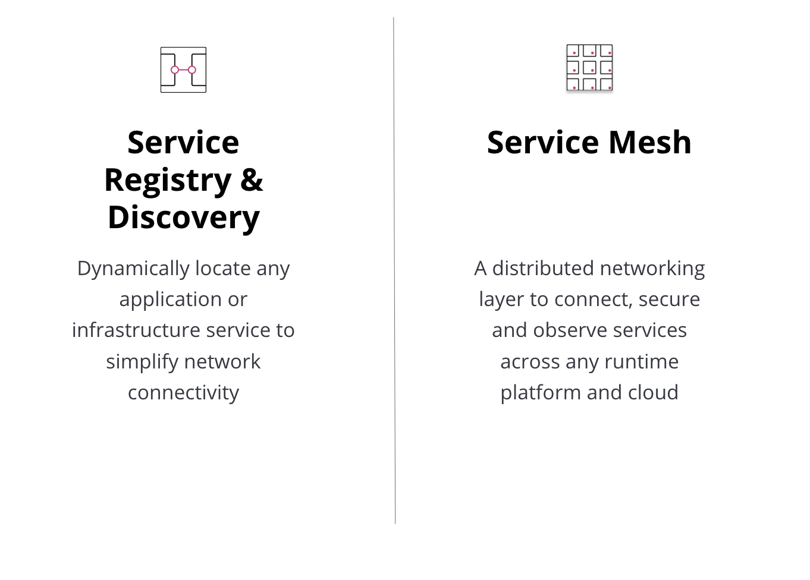
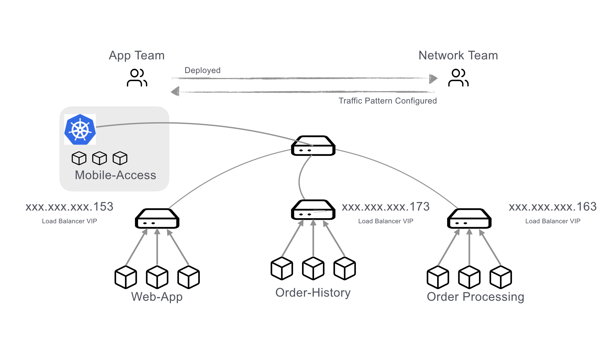
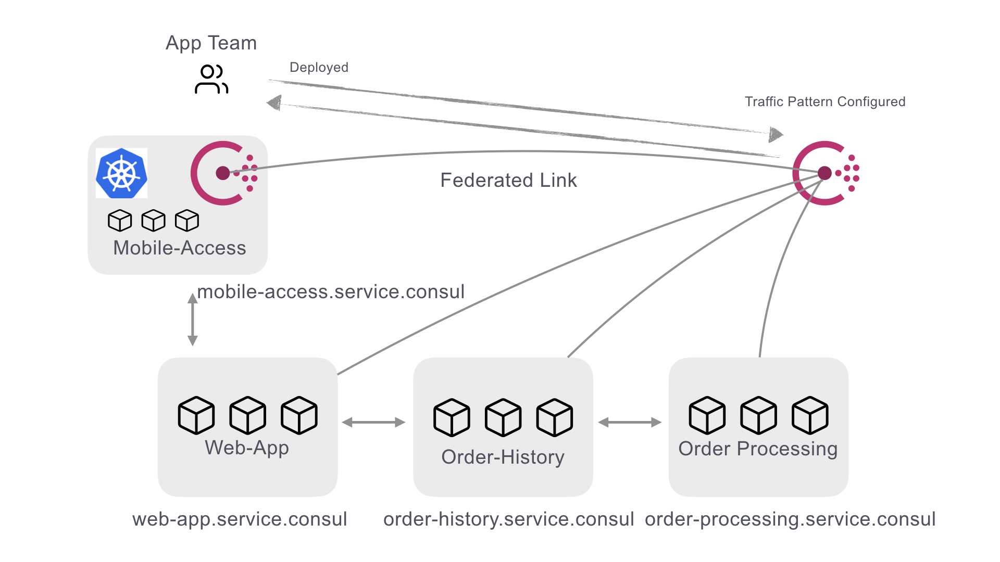
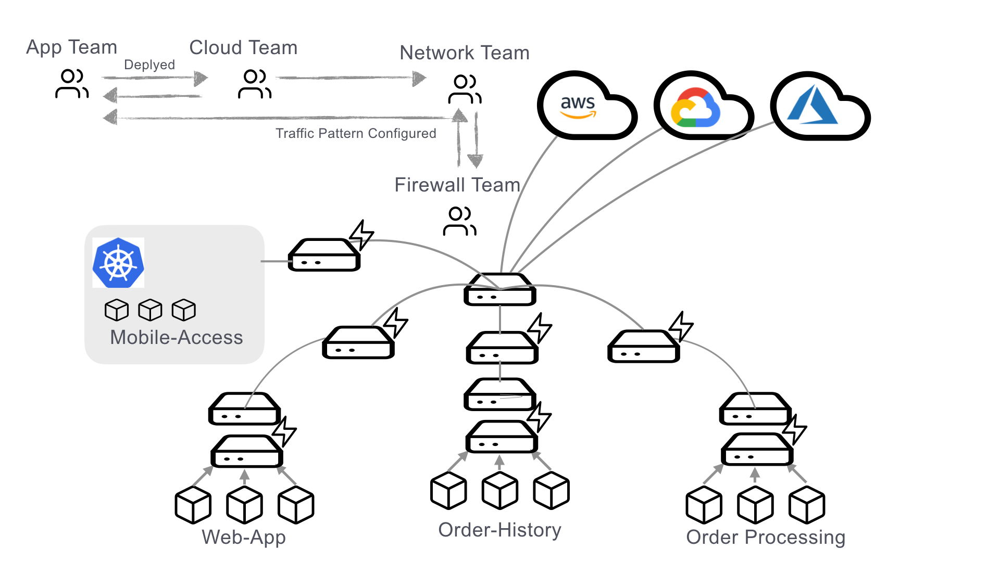
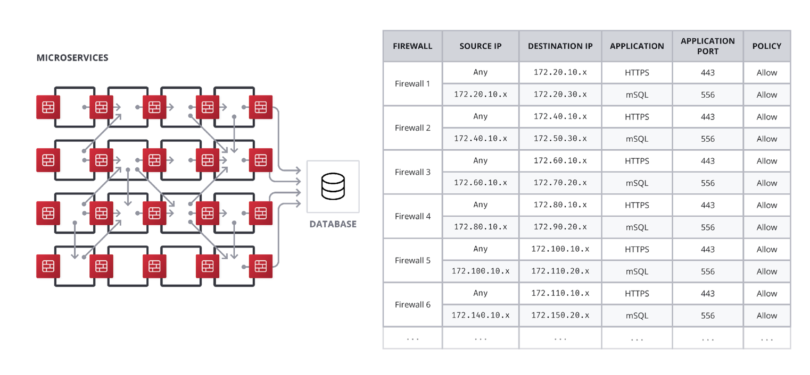
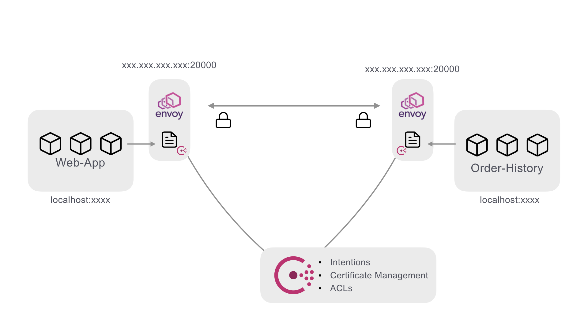
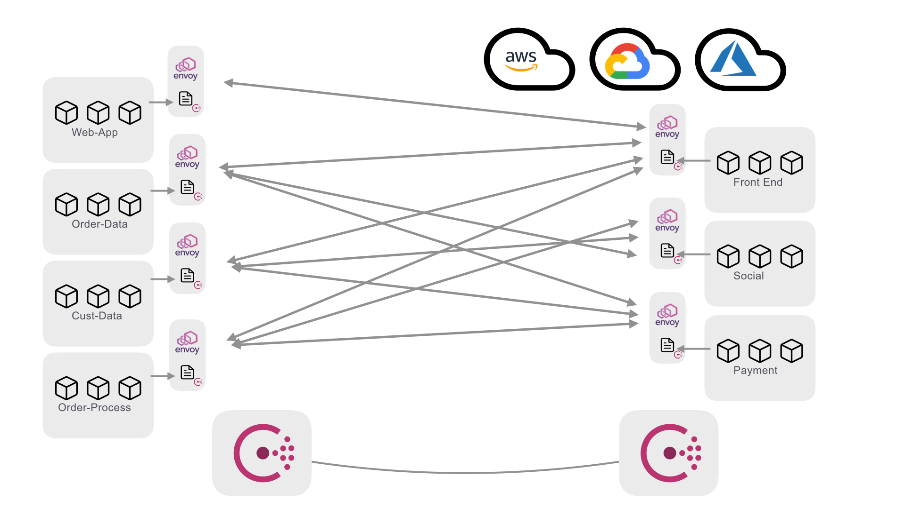

name: Chapter-2
class: title
# Chapter 2
## Consul Use Cases

---
name: Consul-Use-Cases
Consul Adoption Journey
-------------------------
.center[]

???
As we start to dive into how to use Consul it is important to think about how you would go about adopting this in your environments.  First and foremost adopting a standard way of service discovery across a single application or federation of applications is a critical first step.  Because of this we will begin with looking at consul's robust feature set around service discovery. Next we'll look at advanced service networking techniques by exploring how to implement a Service Mesh.

---
name: Load-Balancers-Service-Discovery
class: compact
Service Discovery and Load Balancers
-------------------------

.center[]

* Services location is paramount
* Traditionally done with load balancers
   * Expensive
   * Hard to maintain
   * Load grows as you scale
   * Requires health probes for every backend system
???
The current mode of operation for handling service discovery is usually done with load balancers as seen here in the diagram.  When I want to provision a new service it gets deployed and then the network team is notified that they need to configure the virtual IPs on the load balancer to pick up the service and start routing traffic to it.  This is time consuming, error prone, and can typically have long lead times.  Consul can help mitigate some of these problems.

---
name: Service-Discovery-with-Consul
class: compact
Service Discovery with Consul
-------------------------
.center[]
* Services self-register
* Service health is defined by the service and maintained by the consul agent
* Services are able to query each other via DNS or HTTP

???
In a consul environment services are able to register themselves by defining health checks, service names and optional metadata. Coupled with the gossip protocol--which provides node-level health data--service availability and routing data is updated in near real time.  This allows service discovery to be offloaded from the network and load balancer teams and shifted to the application teams.  This is a crucial first step for an organization to take advantage of the benefits of a service mesh, or if they want to simplify basic application routing decisions.


---
name: Myriad-Use-Cases
class: compact
Solve Network Problems with Service Discovery
-------------------------
Consul prepared queries allow you to build logic into your DNS based service catalog. This enables transparent failover when the primary datacenter becomes unavailable.

```json
{
  "Name": "banking-app",
  "Service": {
    "Service": "banking-app",
    "Tags": ["v1.2.3"],
    "Failover": {
      "Datacenters": ["dc2", "dc3"]
    }
  }
}
```

???
With consul at the heart of service routing based on service names, failover can be defined at the service level with simple extensions to the Consul service definition. This allows for code based resiliency for downstream dependencies.

---
name: Myriad-Use-Cases-Example
Example
-------------------------

There are many other practical use cases that can be solved with the Consul catalog. Some of these scenarios include: automatic routing of traffic to healthy nodes, blue/green deployments, service locks, configuration management and more. Learn more about practical, real-world uses for Consul in this HashiConf talk:

.center[
<a href="https://www.youtube.com/watch?v=XZZDVUCCilM" target=_blank>Consul Infrastructure Recipes - the story of Taco Hub 🌮</a>
]


???
When you have some time, this is a great talk from HashiConf which dives into a number different Consul use cases and give you some bit-size recipes.

---
name: Secure-Networking-is-Hard
class: compact
Secure Networking is Hard
-------------------------
.center[]

* Once applications can find each other security becomes the next concern
* This is usually done with a heavy dose of firewalls
* This adds significant burden to the network organization
* Huge lists of firewall rules

???
Okay, so the bottom line is secure networking in moderng application operations is hard. We need devices and services to be able to communicate with one another, and even discover one another, but it can't just be a free-for-all. Our network needs rules to govern who can talk to who, and what information can be passed over it. We traditionally did this with firewalls, but that adds a huge burden by creating single points of failure and potentially massive lists of firewall rules, often updated by humans in human time.

---
name: Firewalls-Wont-Scale
Firewalls Won't Scale
-------------------------
.center[]
* Heavy interdependencies
* Hard to automate
* Hard to optimize

???
If you take this mindset to its logical conclusion you will end up with something like this.  Firewalls attached to every service trying to enforce all upstream and downstream communications channels.  At scale and with the speed and dynamics of modern application delivery, this is completely unmanageable.
---
name: Consul-Service-Mesh
Consul Connect - A Modern Service Mesh
-------------------------
.center[]

???
Using consul combined with a proxy (typically Envoy) allows for several improvements.
First, Consul can distribute SPIFFE extended TLS certificates that provide both unique service identities as well as end-to-end encryption. Certificates are automatically rotated, further reducing administrative burden.
Second with Intentions, you can define which services are allowed to talk to each other with simple service names. Connections are enforced by the identities provided by the certificates.
Third Consul adds an additional layer of enforcement by using ACL tokens to make services prove their initial identities to receive their certificates.
The power of this is that all of this can be defined in a simple service definition.

---
name: Consul-Service-Definition
class: compact
Consul Service Definition
-------------------------

```hcl
services {
  name = “web-app"
  port = 9090
  connect {
    sidecar_service {
      port = 20000
      proxy {
        local_service_address = "127.0.0.1"
        local_service_port = 9090
        upstreams {
          destination_name = “order-processing”
          local_bind_port = 8003
        }
      }
    }
  }
}
```

???
As you can see in this example, the connection definition is defined as a part of the service definition.  

---
name: How-do-we-secure-this
How do we secure this?
-------------------------
.center[]
.center[With great power comes great responsibility...🕸️]

???
Now at scale inside a service mesh there might start to be some issue with all these connections zipping around between datacenters and clouds.  It becomes a lot more difficult to maintain good network edge security when you have a wide berth of communication happening even if the port range is well defined.  

---
name: Mesh-Gateways
Consul Mesh Gateways
-------------------------
.center[]
.center[Secure connections between any app or service across disparate environments]

???
This problem is addressed with the addition of mesh gateways.  Mesh gateways allow for a single point (or points) at the edge of networks that all mesh traffic flows through.  This allows the network teams to control the ingress/egress points at the edge of the network while still allowing the app teams the flexibility to run application components on the platform of their choosing.  In the next lab we are going to explore the concepts of a service mesh in instruqt.
