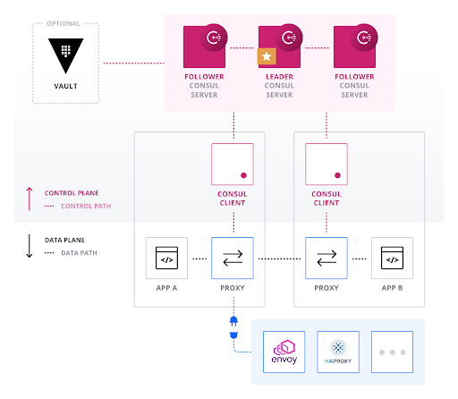
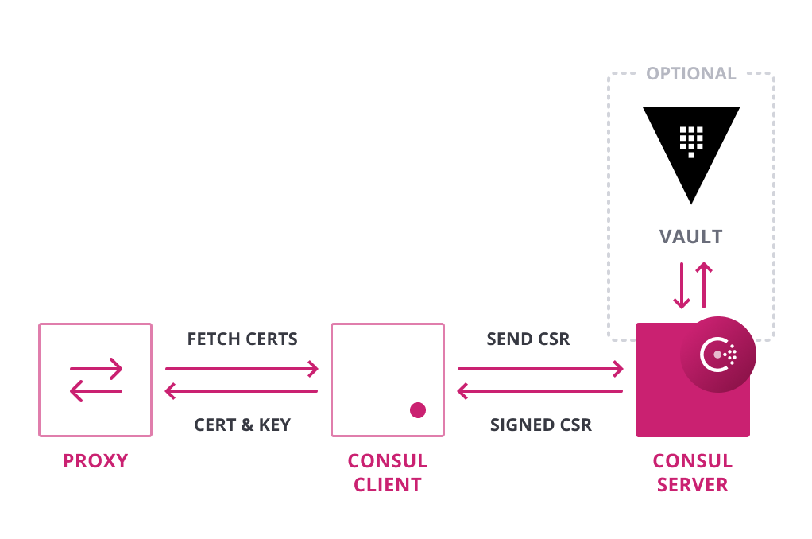

name: Chapter-6
class: title
# Chapter 6
## Service Segmentation

---
name: Segmentation-Intro-Routing
class: img-right compact
Service Segmentation - Intro
-------------------------
.center[]

* Service naming
* Segmentation
* Authorization
* Routing

???
Consul provides a distributed service mesh to connect, secure, and configure services across any runtime platform and cloud.

It provides a highly scalable API driven control plane, and integrates with an array of common proxies that serve as the data plane. Envoy is the most widely used in most service meshes.

This allows critical functionality like naming, segmentation and authorization, at the edge rather than using centralized middleware.  But Consul is flexible.  I can also be used in hybrid environments that employ traditional networking techniques.

---
name: Segmentation-Intro-Security
class: img-right compact
Service Segmentation - Intro
-------------------------
.center[]

* Automatic mTLS
* PKI certificate management
* API-driven

???
Consul enables fine grained service segmentation to secure service-to-service communication with automatic TLS encryption and identity-based authorization.

Consul is flexible and can also integrate it with common centralized PKI and certificate management systems like HashiCorp Vault.

Service configuration is achieved through an API-driven Key/Value store that can be used to easily configure services at runtime in any environment.

---
name: Segmentation-Control-Plane
class: img-right compact
Service Mesh Architecture - Control Plane
-------------------------
.center[]

* Single source of truth
* Manage node services
* Manage access

???
The Control Plane is responsible for configuring the data plane. It's responsible for features like network policy enforcement and providing service discovery data to the data plane. It is designed to be highly scalable by not making direct decisions on traffic by sending instructions to the data plane only when something changes.   This leverages capabilities such as long polling and integrated K/V that have been part of Consul since the beginning.

Consul is the control plane for the Connect service mesh:

* Single source of truth for service catalog, routing, and access policies
* Manages registered services and health checks for that node
* Manages certificates and access policies and configures the proxy

---
name: Segmentation-Data-Plane
class: img-right compact
Service Mesh Architecture - Data Plane
-------------------------
.center[]

* Manage application requests
* High throughput, low latency
* Advanced Layer 7 features

???
The Data Plane provides the ability to forward requests from the applications, including more sophisticated features like health checking, load balancing, circuit breaking, authentication, and authorization.

The Data Plane is in the critical path of data flow from one application to the other and hence the need for high throughput and low latency.

The Consul Envoy integration is currently the primary way to utilize advanced layer 7 features provided by Consul, but can integrate with other third party proxies.

The Consul data plane caches instructions from the control plane and only changes on updates making it extremely fast and highly scalable. 

---
name: Segmentation-Identity
class: img-right compact
Service Mesh - Identity
-------------------------
.center[]

* Provide service identity
* Encryption of all traffic
* Standard TLS certificate with SPIFFE compatibility
* Built-in certificate authority (CA) or integrated with 3rd party CA, such as Vault

???
Consul provides each service with an identity encoded as a SPIFFE-compatible TLS certificate. This way, all traffic between services is encrypted. You can use either the build-in certificate authority, or you can use Vault's CA.

---
name: Segmentation-Access-Graph
class: img-right compact
Service Mesh - Service Access Graph
-------------------------
.center[]

* Logical service name (not IP)
* Scales independent of instances
* Consistency insured with Raft
* Manage with web UI, CLI, and API
* Multi-datacenter support

???
With each service having its own identity, we're able to allow or deny service-to-service communication with Intentions. Intentions follow the same concept as firewall rules, where you grant or deny access based on source and destination. Except we're not specifying IPs or IP ranges. Instead, we're specifying service names and letting Consul deal with the underlying networking.

Now, we can scale out without adding or deleting firewall rules when service endpoints come alive or die. Because Consul provides a way to federate services between clusters and datacenters, we can securely connect services no matter where they reside.

---
name: Segmentation-Access-Graph
class: img-right compact
Service Mesh - Advanced Routing
-------------------------
.center[]

* Canary testing
* A/B tests
* Blue/Green deploys

???
Layer 7 traffic management allows operators to divide L7 traffic between different subsets of service instances when using Connect.

There are many ways you may wish to segment services beyond simply returning all healthy instances for load balancing. This includes patterns like Canary Testing, A/B or Blue/Green deployments.  

---
name: Segmentation-Mesh-Gateways
class: img-right compact
Service Mesh - Mesh Gateways
-------------------------
.center[]

* Route Connect traffic between clusters
* Overcome interconnectivity issues
* Encryption remains intact

???
Mesh gateways enable routing of Connect traffic between different Consul datacenters:

* Datacenters can reside in different clouds or runtime environments where general interconnectivity between all services in all datacenters isn't feasible.
* Gateways operate by sniffing the SNI header out of the Connect session and then route the connection to the appropriate destination based on the server name requested.
* The data within the Connect session is not decrypted by the Gateway.

---
name: Segmentation-Lab
# 👩‍💻 Lab Exercise: Service Segmentation
.blocklist[
You will accomplish the following in this lab:

* Deploy a Sidecar
* Learn about the Envoy Proxy
* Deploy and configure a Proxy
* Use Consul to connect and secure traffic
]

Your instructor will provide the URL for the lab environment.
---
name: Segmentation-Lab-K8s
# 👩‍💻 Bonus Lab: Service Segmentation - K8s
.blocklist[
You will accomplish the following in this lab:

* Deploy Connect on K8s
* Connect a microservice
* Scale your application
* Observe application performance
]

Your instructor will provide the URL for the lab environment.

---
name: Segmentation-Lab-Hybrid
# 👩‍💻 Bonus Lab: Service Segmentation - Hybrid
.blocklist[
You will accomplish the following in this lab:

* Deploy Connect on K8s and VMs
* Connect two datacenters over a WAN
* Use Mesh Gateways to solve for multi-datacenter network complexities
]

Your instructor will provide the URL for the lab environment.
